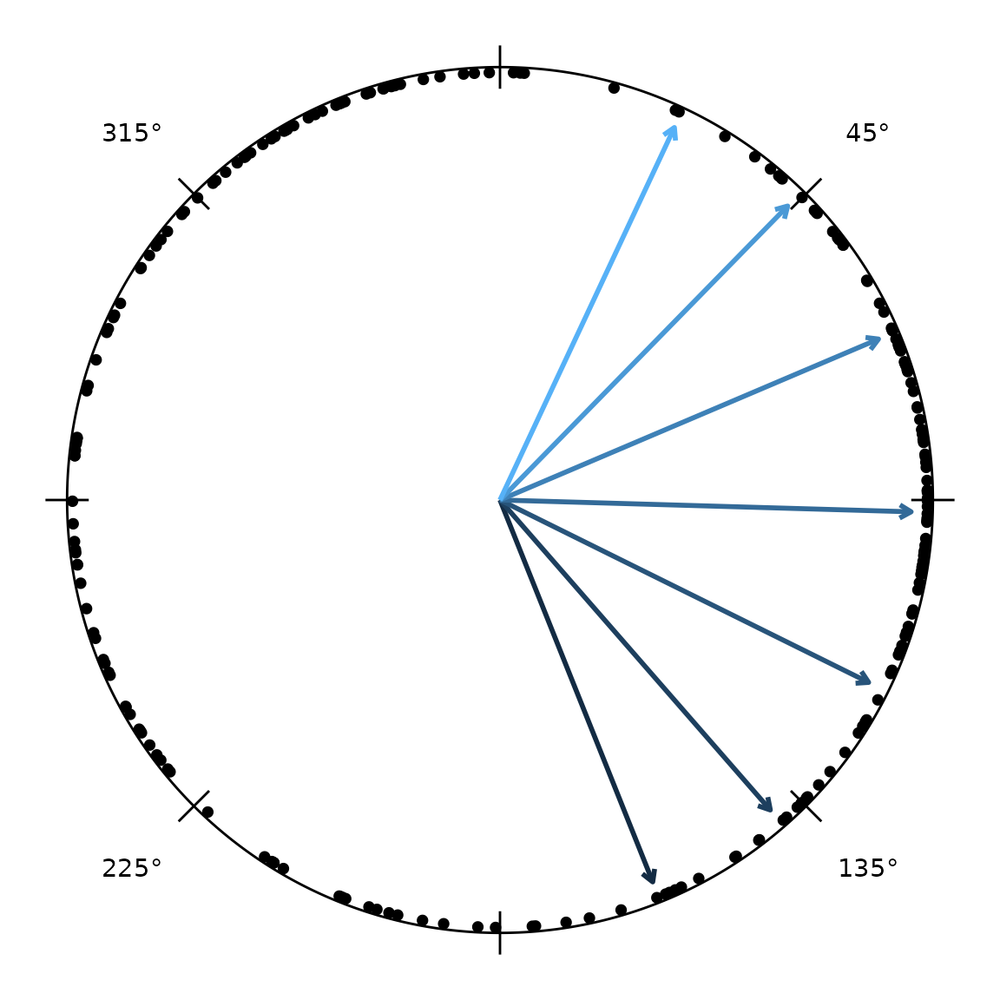
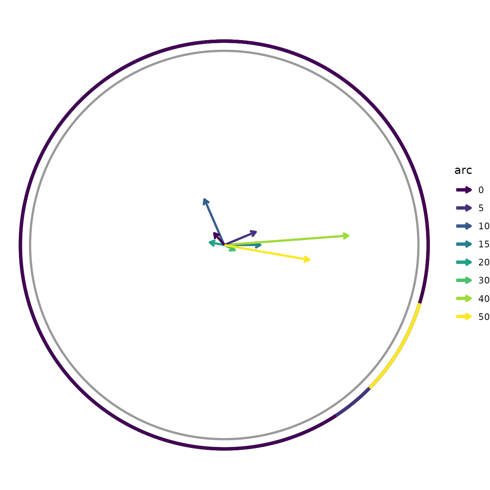

# Circular Statistics and Distribution Overlays

``` r

if (requireNamespace("pkgload", quietly = TRUE)) {
  pkgload::load_all("..", export_all = FALSE, helpers = FALSE, quiet = TRUE)
} else if (requireNamespace("radiatR", quietly = TRUE)) {
  library(radiatR)
} else {
  stop("Package 'radiatR' not installed and 'pkgload' not available.")
}
library(ggplot2)
```

## Overview

The main *radiatR* vignette covers the path from raw tracking files to a
plotted set of headings. This vignette picks up from a heading data
frame and shows the analysis layer:

- **Dispersion summaries** —
  [`circ_dispersion()`](https://johnkirwan.github.io/radiatR/reference/circ_dispersion.md),
  [`sector_summary()`](https://johnkirwan.github.io/radiatR/reference/sector_summary.md)
- **Parametric fits** —
  [`vonmises_fit()`](https://johnkirwan.github.io/radiatR/reference/vonmises_fit.md),
  [`wrappedcauchy_fit()`](https://johnkirwan.github.io/radiatR/reference/wrappedcauchy_fit.md)
- **Hypothesis tests** —
  [`test_uniformity()`](https://johnkirwan.github.io/radiatR/reference/test_uniformity.md),
  [`test_mean_directions()`](https://johnkirwan.github.io/radiatR/reference/test_mean_directions.md),
  [`test_concentration()`](https://johnkirwan.github.io/radiatR/reference/test_concentration.md),
  all with multiple-comparison correction
- **Correlation** —
  [`circ_cor()`](https://johnkirwan.github.io/radiatR/reference/circ_cor.md)
  (circular-linear and circular-circular)
- **Distribution overlays** —
  [`add_angle_rose()`](https://johnkirwan.github.io/radiatR/reference/add_angle_rose.md),
  [`add_vonmises_density()`](https://johnkirwan.github.io/radiatR/reference/add_vonmises_density.md),
  [`add_wrappedcauchy_density()`](https://johnkirwan.github.io/radiatR/reference/add_wrappedcauchy_density.md),
  [`add_circular_kde()`](https://johnkirwan.github.io/radiatR/reference/add_circular_kde.md)
- **Significance geometry** —
  [`add_critical_r()`](https://johnkirwan.github.io/radiatR/reference/add_critical_r.md)
  (Rayleigh / V-test circle) and
  [`add_critical_v_line()`](https://johnkirwan.github.io/radiatR/reference/add_critical_v_line.md)
  (V-test boundary)

Every statistics function takes a data frame with a heading column in
radians (default name `"heading"`) and returns a tidy data frame, so the
results drop straight into `dplyr`,
[`knitr::kable()`](https://rdrr.io/pkg/knitr/man/kable.html), or further
plotting.

## A heading data frame

We derive one heading per trial from the bundled `cpunctatus` dataset
with the ring-crossing rule, then attach each trial’s target half-width
(`arc`) for grouping. This is the same construction used in the main
vignette.

``` r

data(cpunctatus)

hd <- derive_headings(cpunctatus, rule = "crossing",
                      circ0 = 0.2, circ1 = 0.4,
                      coords = "relative",
                      angle_convention = "clock")
#> Warning: derive_headings(rule = 'crossing'): 25 of 251 trials (10.0%) produced
#> no heading and are excluded from circular statistics. Rule-based failures are
#> often non-random and can bias results; inspect attr(x, "missing_ids").
names(hd)[names(hd) == "id"] <- "trial_id"

# attach target half-width (arc) from the dataset, by trial
arc_map  <- unique(cpunctatus@data[, c("trial_id", "arc")])
hd       <- merge(hd, arc_map, by = "trial_id")
hd$arc   <- factor(hd$arc)

# keep trials with a defined crossing heading
hd <- hd[is.finite(hd$heading), , drop = FALSE]
head(hd[, c("trial_id", "arc", "heading")])
#>   trial_id arc   heading
#> 1   10_1_1  10 0.2777794
#> 2  10_10_1  10 3.0376774
#> 3  10_11_1  10 6.0710737
#> 4  10_12_1  10 2.2074837
#> 5  10_13_1  10 0.9322361
#> 6  10_14_1  10 4.7955587
```

The `heading` column is in radians, reference-relative (0 = toward the
target). Everything below operates on that column.

If you only need a summary and not the heading frame itself,
[`circ_summary_headings()`](https://johnkirwan.github.io/radiatR/reference/circ_summary_headings.md)
derives headings from the tracks with a chosen rule and returns the
circular summary in one call. `group_by = NULL` pools all trials;
`group_by = "id"` (the default) gives one row per trial:

``` r

circ_summary_headings(cpunctatus, rule = "distal", group_by = NULL)
#>   mean_dir resultant_R      kappa   n group
#> 1 1.814938  0.04215183 0.08437866 235   all
```

## Dispersion summaries

[`circ_dispersion()`](https://johnkirwan.github.io/radiatR/reference/circ_dispersion.md)
returns the mean direction, resultant length *R*, and circular standard
deviation. Grouping by `arc` gives one row per condition.

``` r

circ_dispersion(hd, group_col = "arc")
#>   arc    mean_dir resultant_R   circ_sd  n
#> 1  10 1.980062802  0.25662879 1.6493178 35
#> 2  15 0.002875648  0.18589914 1.8344214 27
#> 3  20 2.960834000  0.07603959 2.2700225 24
#> 4  30 5.830185048  0.06016175 2.3709570 34
#> 5  40 0.075648794  0.64058845 0.9437882 19
#> 6   5 0.394217868  0.17579270 1.8646446 30
#> 7  50 6.109431857  0.44404605 1.2742268 24
#> 8   0 2.276557489  0.08000698 2.2475059 33
```

*R* runs from 0 (uniformly scattered) to 1 (all headings identical); the
circular SD moves the opposite way. For dense per-frame heading series —
gaze direction from a tethered subject, say —
[`sector_summary()`](https://johnkirwan.github.io/radiatR/reference/sector_summary.md)
bins the angles and reports dwell proportions per sector:

``` r

sector_summary(hd, sectors = 8L)
#>        sector  mid_angle count proportion
#> 1 -158degrees -2.7488936    27 0.11946903
#> 2 -112degrees -1.9634954    18 0.07964602
#> 3  -68degrees -1.1780972    20 0.08849558
#> 4  -22degrees -0.3926991    42 0.18584071
#> 5   22degrees  0.3926991    45 0.19911504
#> 6   68degrees  1.1780972    13 0.05752212
#> 7  112degrees  1.9634954    35 0.15486726
#> 8  158degrees  2.7488936    26 0.11504425
```

## Parametric fits

[`vonmises_fit()`](https://johnkirwan.github.io/radiatR/reference/vonmises_fit.md)
estimates the mean direction $`\mu`$ and concentration $`\kappa`$ by
maximum likelihood, with asymptotic standard errors and a confidence
interval on $`\mu`$:

``` r

vonmises_fit(hd, group_col = "arc")[, c("arc", "mu_deg", "kappa", "n")]
#>   arc      mu_deg     kappa  n
#> 1  10 113.4492417 0.5310863 35
#> 2  15   0.1647625 0.3784077 27
#> 3  20 169.6432921 0.1525210 24
#> 4  30 -25.9550030 0.1205419 34
#> 5  40   4.3343566 1.6868180 19
#> 6   5  22.5870200 0.3571578 30
#> 7  50  -9.9553394 0.9900343 24
#> 8   0 130.4371359 0.1605288 33
```

[`wrappedcauchy_fit()`](https://johnkirwan.github.io/radiatR/reference/wrappedcauchy_fit.md)
is the heavier-tailed alternative — more robust when the data have
outliers or weak directionality. Its concentration $`\rho`$ is bounded
to $`[0, 1)`$:

``` r

wrappedcauchy_fit(hd, group_col = "arc")[, c("arc", "mu_deg", "rho", "n")]
#>   arc     mu_deg        rho  n
#> 1  10 118.338958 0.25480084 35
#> 2  15   4.745037 0.27375349 27
#> 3  20 159.559101 0.09056095 24
#> 4  30 339.103222 0.08571126 34
#> 5  40   6.248322 0.75905693 19
#> 6   5  25.796263 0.15937039 30
#> 7  50 351.847489 0.68966189 24
#> 8   0 133.599471 0.08467292 33
```

Both return a row per group, so a quick
[`merge()`](https://rdrr.io/r/base/merge.html) puts the two
concentration estimates side by side for comparison.

## Hypothesis tests

### Uniformity

[`test_uniformity()`](https://johnkirwan.github.io/radiatR/reference/test_uniformity.md)
asks, per group, whether the headings have *any* preferred direction.
The Rayleigh test gives an exact p-value; when testing many conditions
at once, pass `p_adjust` for a corrected `p_value_adj` column:

``` r

test_uniformity(hd, group_col = "arc", test = "rayleigh", p_adjust = "BH")
#>   arc  statistic     p_value  n     test p_value_adj
#> 1  10 0.25662879 0.099244958 35 rayleigh 0.264653222
#> 2  15 0.18589914 0.397036850 27 rayleigh 0.638463349
#> 3  20 0.07603959 0.872766166 24 rayleigh 0.885708681
#> 4  30 0.06016175 0.885708681 34 rayleigh 0.885708681
#> 5  40 0.64058845 0.000186684 19 rayleigh 0.001493472
#> 6   5 0.17579270 0.399039593 30 rayleigh 0.638463349
#> 7  50 0.44404605 0.007583494 24 rayleigh 0.030333977
#> 8   0 0.08000698 0.811900045 33 rayleigh 0.885708681
```

### Equal mean directions

[`test_mean_directions()`](https://johnkirwan.github.io/radiatR/reference/test_mean_directions.md)
is the Watson-Williams test — the circular analogue of a one-way ANOVA
on the mean angle. The omnibus form asks whether *any* group differs:

``` r

test_mean_directions(hd, group_col = "arc")
#>   n_groups statistic df1 df2     p_value            test
#> 1        8  8.230315   7 218 6.70879e-09 Watson-Williams
```

Set `pairwise = TRUE` for all pairwise comparisons; `p_adjust` is
strongly recommended here because the number of comparisons grows
quickly:

``` r

pw <- test_mean_directions(hd, group_col = "arc",
                           pairwise = TRUE, p_adjust = "holm")
head(pw[order(pw$p_value_adj), ])
#>    group1 group2 statistic df1 df2      p_value            test  p_value_adj
#> 14     20     30  68.71016   1  56 2.590906e-11 Watson-Williams 7.254536e-10
#> 22     30      0  45.35938   1  65 5.086470e-09 Watson-Williams 1.373347e-07
#> 6      10     50  31.92401   1  57 5.341214e-07 Watson-Williams 1.388716e-05
#> 4      10     40  24.34873   1  52 8.658990e-06 Watson-Williams 2.164747e-04
#> 1      10     15  16.68434   1  60 1.328071e-04 Watson-Williams 3.187369e-03
#> 13     15      0  16.32869   1  58 1.586887e-04 Watson-Williams 3.649841e-03
```

### Equal concentrations

[`test_concentration()`](https://johnkirwan.github.io/radiatR/reference/test_concentration.md)
checks whether the groups are equally concentrated (the circular
analogue of a test for equal variances), a key assumption behind the
Watson-Williams test above:

``` r

test_concentration(hd, group_col = "arc")
#>   statistic df    p_value        test
#> 1  14.23259  7 0.04719587 equal.kappa
```

## Circular correlation

[`circ_cor()`](https://johnkirwan.github.io/radiatR/reference/circ_cor.md)
measures the association between headings and a covariate. With
`x_type = "linear"` (the default) it computes the circular-linear
correlation — here, whether heading direction is associated with the
numeric target half-width:

``` r

hd$arc_num <- as.numeric(as.character(hd$arc))
circ_cor(hd, x_col = "arc_num", angle_col = "heading", x_type = "linear")
#>           r   n            type statistic df    p_value
#> 1 0.2175965 226 circular-linear   10.7007  2 0.00474648
```

The returned `r` is unsigned (association strength, 0–1); the test
statistic $`n r^2`$ is approximately $`\chi^2_2`$. For two angular
variables, pass `x_type = "circular"` to get Fisher’s
$`\rho \in [-1, 1]`$.

## Circular regression

Where
[`circ_cor()`](https://johnkirwan.github.io/radiatR/reference/circ_cor.md)
measures the *strength* of an association,
[`circ_regression()`](https://johnkirwan.github.io/radiatR/reference/circ_regression.md)
*models* it: it fits the Fisher–Lee circular–linear regression of a
heading on one or more linear covariates, via a formula interface over
[`circular::lm.circular()`](https://rdrr.io/pkg/circular/man/lm.circular.html).
To show that the fit recovers a known effect, we simulate trajectories
whose mean heading shifts with a predictor — the per-condition
`mean_slope` controls that shift — and then fit the model back:

``` r

cond <- data.frame(condition = "demo", n_trials = 120, ref_mean = 0,
                   concentration_base = 12, mean_slope = 0.6,
                   predictor_mean = 0, predictor_sd = 1)
s   <- simulate_tracks(conditions = cond, n_points = 8, seed = 1)
reg <- s[!duplicated(s$trial_id), c("predictor", "final_heading")]
names(reg)[2] <- "heading"

fit <- circ_regression(reg, heading ~ predictor)
summary(fit)
#>        term  estimate         se statistic p_value  conf.low conf.high
#> 1 predictor 0.3281699 0.02007503  16.34717       0 0.2888236 0.3675163
```

The coefficient table recovers a **positive, significant** slope for
`predictor`, confirming the simulated effect. Note the magnitude: the
Fisher–Lee model links the mean heading to the linear predictor through
a $`2\arctan(\cdot)`$ function, so the fitted slope is on that **link
scale** and is attenuated relative to the plain `mean_slope` used to
simulate. Interpret the **sign and significance** of the coefficients
directly, and use [`predict()`](https://rdrr.io/r/stats/predict.html) to
read the effect back on the angular (heading) scale:

``` r

predict(fit, data.frame(predictor = c(-1, 0, 1)))
#> [1] 5.6202847 6.2544774 0.6054847
```

The predicted mean heading tracks the predictor — rotating with its
value — exactly as the simulation set up.

The fitted relationship can be drawn straight onto the circular panel:
each covariate value becomes a mean-direction arrow, colour-graded by
the predictor, so you see the mean heading sweep as the covariate
increases.

``` r

radiate(headings_frame(hd, heading, units = "radians")) +
  add_circ_mean(fitted_directions(fit, at = seq(-2, 2, length.out = 7)),
                colour_col = "predictor")
```



## Distribution overlays

The overlay layers draw an angular distribution in the same Cartesian
unit-disc space as
[`radiate()`](https://johnkirwan.github.io/radiatR/reference/radiate.md),
so they compose onto a bare circular canvas with `+`. We build that
canvas once:

``` r

canvas <- ggplot() + coord_fixed() +
  add_circ(radius = 1) +
  theme_void()
```

A **rose diagram** bins the headings into wedges; the parametric and
non-parametric density curves overlay on top. Giving every layer the
same `scale` aligns their radii, so the shapes can be compared directly:

``` r

vm <- vonmises_fit(hd)        # pooled fit (group_col = NULL)
wc <- wrappedcauchy_fit(hd)

canvas +
  add_angle_rose(hd, bins = 12, scale = 0.8, fill = "grey80") +
  add_circular_kde(hd, scale = 0.8, colour = "tomato") +
  add_vonmises_density(vm, scale = 0.8, colour = "steelblue") +
  add_wrappedcauchy_density(wc, scale = 0.8, colour = "darkorange")
```


The grey wedges are the empirical rose; the **steelblue** curve is the
von Mises fit, **darkorange** the wrapped Cauchy, and **tomato** a
circular kernel density estimate. Where the parametric curves track the
rose closely the fit is good; a systematic gap (especially in the tails)
is the cue to prefer the heavier-tailed wrapped Cauchy.

To show the **individual** headings rather than a smoothed distribution,
[`add_stacked_headings()`](https://johnkirwan.github.io/radiatR/reference/add_stacked_headings.md)
fans coincident headings into radial columns of dots, reducing the
overplotting of points stacked at the same angle. It needs a
`headings_frame` (the object
[`derive_headings()`](https://johnkirwan.github.io/radiatR/reference/derive_headings.md)
returns), so we use a fresh one here — `hd` above was demoted to a plain
data frame by the [`merge()`](https://rdrr.io/r/base/merge.html)/subset:

``` r

hd_frame <- derive_headings(cpunctatus, rule = "distal")
radiate(hd_frame, show_markers = FALSE) + add_stacked_headings(hd_frame)
```


`step` sets the gap between dots and `start_sep` the inward offset of
the first dot from the rim; pass `axial = TRUE` to draw each datum at
both poles.

## Per-group overlays

Heading-summary overlays subdivide by a column to draw one element per
group, coloured by it – handy for comparing conditions on one plot. The
mean-direction **arrow**
([`add_heading_arrow()`](https://johnkirwan.github.io/radiatR/reference/add_heading_arrow.md))
takes a `colour_col`; its bootstrap **confidence interval**
([`add_heading_interval()`](https://johnkirwan.github.io/radiatR/reference/add_heading_interval.md))
takes a `group_col`. Here both are split by target half-width (`arc`):

``` r

canvas +
  add_heading_arrow(hd,    colour_col = "arc") +
  add_heading_interval(hd, group_col  = "arc", stat = "bootstrap_ci")
```



Each `arc` group gets its own mean vector and CI arc in a matching
colour. The grouping is independent of any faceting, so you can (for
example) colour by cohort while faceting
[`radiate()`](https://johnkirwan.github.io/radiatR/reference/radiate.md)
by treatment.
[`radiate()`](https://johnkirwan.github.io/radiatR/reference/radiate.md)’s
own built-in arrow follows the same idea via `arrow_colour_col`, drawing
one arrow per group:

``` r

radiate(cpunctatus, group_col = "trial_id",
        show_arrow = TRUE, arrow_colour_col = "arc")
```

## Significance geometry

The remaining two helpers draw the *decision boundary* of a significance
test directly in resultant-length space (radius 0–1), so it can be read
against the observed mean vector.

[`add_critical_r()`](https://johnkirwan.github.io/radiatR/reference/add_critical_r.md)
draws the **Rayleigh critical circle**: the mean resultant length needed
for significance at level `alpha`, namely
$`r_\text{crit} = \sqrt{-\log(\alpha)/n}`$. If the mean vector reaches
past the circle, the headings are significantly non-uniform.

``` r

disp <- circ_dispersion(hd)
mean_vec <- data.frame(x = disp$resultant_R * cos(disp$mean_dir),
                       y = disp$resultant_R * sin(disp$mean_dir))

canvas +
  add_critical_r(hd, alpha = 0.05, test = "rayleigh") +
  geom_segment(data = mean_vec,
               aes(x = 0, y = 0, xend = x, yend = y),
               arrow = arrow(length = unit(0.15, "inches")),
               linewidth = 1)
```


``` r

test_uniformity(hd, test = "rayleigh")
#>   statistic    p_value   n     test
#> 1 0.1298181 0.02217652 226 rayleigh
```

The arrow tip lies well outside the dashed critical circle, matching the
tiny Rayleigh p-value above.

[`add_critical_v_line()`](https://johnkirwan.github.io/radiatR/reference/add_critical_v_line.md)
is the corresponding boundary for the **V-test**, which tests uniformity
against a *specified* direction `mu0` (here 0, i.e. toward the target).
Unlike the Rayleigh circle, the V-test boundary is a straight line
perpendicular to `mu0`: significance requires the mean vector’s
projection onto `mu0` to exceed $`c = z_\alpha / \sqrt{2n}`$. Set
`show_region = TRUE` to shade the rejection side.

``` r

canvas +
  add_critical_v_line(hd, mu0 = 0, alpha = 0.05, show_region = TRUE) +
  geom_segment(data = mean_vec,
               aes(x = 0, y = 0, xend = x, yend = y),
               arrow = arrow(length = unit(0.15, "inches")),
               linewidth = 1)
```


When the experiment has an *a priori* expected direction (the target),
the V-test is more powerful than the omnibus Rayleigh test, and the line
makes the one-sided nature of the decision visible.

## Periodic data: time of day or year

Headings are not the only angles. Any **periodic** variable — the time
of day an event occurs (chronobiology), the day of the year (phenology),
or a generic cycle — maps onto the circle, and then every tool above
applies.
[`as_angle()`](https://johnkirwan.github.io/radiatR/reference/as_angle.md)
does the mapping in the same clock/calendar convention as the
circumference labels, so a `06:00` event lands on the `"6"` o’clock
label.

``` r

set.seed(1)
# 200 events: a strong morning cluster (~09:00) and a weaker evening one (~21:00)
times <- as.POSIXct("2020-06-01", tz = "UTC") +
  c(rnorm(150, 9 * 3600, 1.2 * 3600), rnorm(50, 21 * 3600, 3600))

events <- headings_frame(data.frame(heading = as_angle(times, "day")),
                         col = heading, units = "radians")

# is the timing non-uniform over the day?
test_uniformity(events, test = "rayleigh")
#>   statistic      p_value   n     test
#> 1 0.4789747 1.183343e-20 200 rayleigh

radiate(events, angle_labels = "hours")
```


The dots cluster at their clock positions, and the Rayleigh test
confirms the day is not uniform. Use `period = "year"` for
`Date`/`POSIXct` day-of-year data (pair it with
`angle_labels = "months"`), or a positive number for a custom cycle
length.

## Where next

- The **main vignette** covers building these heading data frames and
  the trajectory/heading-overlay plotting layers.
- The **Loaders vignette** covers reading tracking exports from 20+
  tools into the `Tracks` objects these analyses start from.
- Every function above is documented individually under *Reference*,
  grouped by role (summaries, parametric fitting, correlation,
  hypothesis tests, and distribution overlays). \`\`\`
