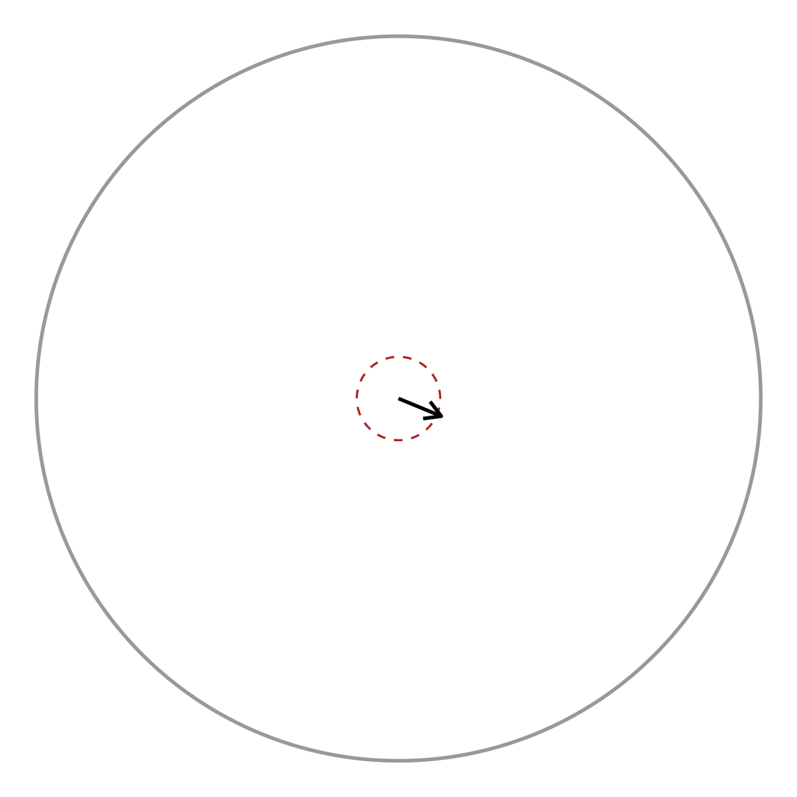
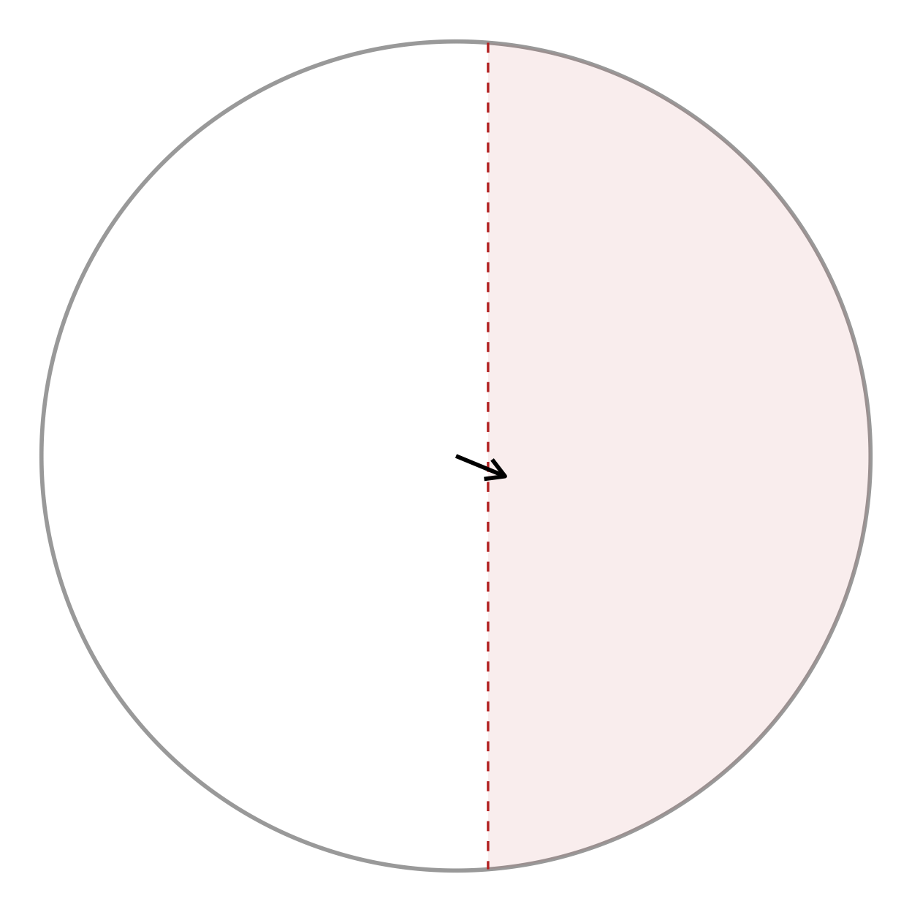

# Circular Statistics and Distribution Overlays

``` r

if (requireNamespace("pkgload", quietly = TRUE)) {
  pkgload::load_all("..", export_all = FALSE, helpers = FALSE, quiet = TRUE)
} else if (requireNamespace("radiatR", quietly = TRUE)) {
  library(radiatR)
} else {
  stop("Package 'radiatR' not installed and 'pkgload' not available.")
}
library(ggplot2)
```

## Overview

The main *radiatR* vignette covers the path from raw tracking files to a
plotted set of headings. This vignette picks up from a heading data
frame and shows the analysis layer:

- **Dispersion summaries** —
  [`circ_dispersion()`](https://johnkirwan.github.io/radiatR/reference/circ_dispersion.md),
  [`sector_summary()`](https://johnkirwan.github.io/radiatR/reference/sector_summary.md)
- **Parametric fits** —
  [`vonmises_fit()`](https://johnkirwan.github.io/radiatR/reference/vonmises_fit.md),
  [`wrappedcauchy_fit()`](https://johnkirwan.github.io/radiatR/reference/wrappedcauchy_fit.md)
- **Hypothesis tests** —
  [`test_uniformity()`](https://johnkirwan.github.io/radiatR/reference/test_uniformity.md),
  [`test_mean_directions()`](https://johnkirwan.github.io/radiatR/reference/test_mean_directions.md),
  [`test_concentration()`](https://johnkirwan.github.io/radiatR/reference/test_concentration.md),
  all with multiple-comparison correction
- **Correlation** —
  [`circ_cor()`](https://johnkirwan.github.io/radiatR/reference/circ_cor.md)
  (circular-linear and circular-circular)
- **Distribution overlays** —
  [`add_angle_rose()`](https://johnkirwan.github.io/radiatR/reference/add_angle_rose.md),
  [`add_vonmises_density()`](https://johnkirwan.github.io/radiatR/reference/add_vonmises_density.md),
  [`add_wrappedcauchy_density()`](https://johnkirwan.github.io/radiatR/reference/add_wrappedcauchy_density.md),
  [`add_circular_kde()`](https://johnkirwan.github.io/radiatR/reference/add_circular_kde.md)
- **Significance geometry** —
  [`add_critical_r()`](https://johnkirwan.github.io/radiatR/reference/add_critical_r.md)
  (Rayleigh / V-test circle) and
  [`add_critical_v_line()`](https://johnkirwan.github.io/radiatR/reference/add_critical_v_line.md)
  (V-test boundary)

Every statistics function takes a data frame with a heading column in
radians (default name `"heading"`) and returns a tidy data frame, so the
results drop straight into `dplyr`,
[`knitr::kable()`](https://rdrr.io/pkg/knitr/man/kable.html), or further
plotting.

## A heading data frame

We derive one heading per trial from the bundled `cpunctatus` dataset
with the ring-crossing rule, then attach each trial’s target half-width
(`arc`) for grouping. This is the same construction used in the main
vignette.

``` r

data(cpunctatus)

hd <- derive_headings(cpunctatus, rule = "crossing",
                      circ0 = 0.2, circ1 = 0.4,
                      coords = "relative",
                      angle_convention = "clock")
names(hd)[names(hd) == "id"] <- "trial_id"

# attach target half-width (arc) from the dataset, by trial
arc_map  <- unique(cpunctatus@data[, c("trial_id", "arc")])
hd       <- merge(hd, arc_map, by = "trial_id")
hd$arc   <- factor(hd$arc)

# keep trials with a defined crossing heading
hd <- hd[is.finite(hd$heading), , drop = FALSE]
head(hd[, c("trial_id", "arc", "heading")])
#>   trial_id arc   heading
#> 1   10_1_1  10 5.8780666
#> 2  10_10_1  10 3.4283044
#> 3  10_11_1  10 0.3474011
#> 4  10_12_1  10 4.1794923
#> 5  10_13_1  10 5.5416100
#> 6  10_14_1  10 1.3611096
```

The `heading` column is in radians, reference-relative (0 = toward the
target). Everything below operates on that column.

## Dispersion summaries

[`circ_dispersion()`](https://johnkirwan.github.io/radiatR/reference/circ_dispersion.md)
returns the mean direction, resultant length *R*, and circular standard
deviation. Grouping by `arc` gives one row per condition.

``` r

circ_dispersion(hd, group_col = "arc")
#>   arc      mean_dir resultant_R   circ_sd  n
#> 1  10 -1.9513801009  0.28083874 1.5937218 35
#> 2  15 -0.0003910935  0.19793492 1.7998983 27
#> 3  20 -2.9019871675  0.09652689 2.1623754 24
#> 4  30  0.1860117919  0.05781662 2.3876679 34
#> 5  40 -0.0851951450  0.63455690 0.9537592 19
#> 6   5 -0.3693921424  0.15615485 1.9271259 30
#> 7  50  0.2637564723  0.46069491 1.2450054 24
#> 8   0 -2.3094608512  0.07723939 2.2631154 33
```

*R* runs from 0 (uniformly scattered) to 1 (all headings identical); the
circular SD moves the opposite way. For dense per-frame heading series —
gaze direction from a tethered animal, say —
[`sector_summary()`](https://johnkirwan.github.io/radiatR/reference/sector_summary.md)
bins the angles and reports dwell proportions per sector:

``` r

sector_summary(hd, sectors = 8L)
#>        sector  mid_angle count proportion
#> 1 -158degrees -2.7488936    24 0.10619469
#> 2 -112degrees -1.9634954    37 0.16371681
#> 3  -68degrees -1.1780972    12 0.05309735
#> 4  -22degrees -0.3926991    50 0.22123894
#> 5   22degrees  0.3926991    40 0.17699115
#> 6   68degrees  1.1780972    19 0.08407080
#> 7  112degrees  1.9634954    18 0.07964602
#> 8  158degrees  2.7488936    26 0.11504425
```

## Parametric fits

[`vonmises_fit()`](https://johnkirwan.github.io/radiatR/reference/vonmises_fit.md)
estimates the mean direction $`\mu`$ and concentration $`\kappa`$ by
maximum likelihood, with asymptotic standard errors and a confidence
interval on $`\mu`$:

``` r

vonmises_fit(hd, group_col = "arc")[, c("arc", "mu_deg", "kappa", "n")]
#>   arc        mu_deg     kappa  n
#> 1  10 -111.80584401 0.5852832 35
#> 2  15   -0.02240801 0.4038778 27
#> 3  20 -166.27161690 0.1939602 24
#> 4  30   10.65769061 0.1158271 34
#> 5  40   -4.88132224 1.6586879 19
#> 6   5  -21.16461074 0.3161948 30
#> 7  50   15.11213268 1.0364612 24
#> 8   0 -132.32235972 0.1549419 33
```

[`wrappedcauchy_fit()`](https://johnkirwan.github.io/radiatR/reference/wrappedcauchy_fit.md)
is the heavier-tailed alternative — more robust when the data have
outliers or weak directionality. Its concentration $`\rho`$ is bounded
to $`[0, 1)`$:

``` r

wrappedcauchy_fit(hd, group_col = "arc")[, c("arc", "mu_deg", "rho", "n")]
#>   arc     mu_deg        rho  n
#> 1  10 240.033510 0.28228485 35
#> 2  15 354.147727 0.29760542 27
#> 3  20 202.034515 0.11478156 24
#> 4  30  10.919674 0.07904604 34
#> 5  40 355.610286 0.75074167 19
#> 6   5 333.705784 0.14012202 30
#> 7  50   9.081076 0.69560495 24
#> 8   0 225.424784 0.08656156 33
```

Both return a row per group, so a quick
[`merge()`](https://rdrr.io/r/base/merge.html) puts the two
concentration estimates side by side for comparison.

## Hypothesis tests

### Uniformity

[`test_uniformity()`](https://johnkirwan.github.io/radiatR/reference/test_uniformity.md)
asks, per group, whether the headings have *any* preferred direction.
The Rayleigh test gives an exact p-value; when testing many conditions
at once, pass `p_adjust` for a corrected `p_value_adj` column:

``` r

test_uniformity(hd, group_col = "arc", test = "rayleigh", p_adjust = "BH")
#>   arc  statistic      p_value  n     test p_value_adj
#> 1  10 0.28083874 0.0622893496 35 rayleigh 0.166104932
#> 2  15 0.19793492 0.3504909570 27 rayleigh 0.700981914
#> 3  20 0.09652689 0.8029307182 24 rayleigh 0.893970817
#> 4  30 0.05781662 0.8939708170 34 rayleigh 0.893970817
#> 5  40 0.63455690 0.0002250149 19 rayleigh 0.001800119
#> 6   5 0.15615485 0.4849410243 30 rayleigh 0.775905639
#> 7  50 0.46069491 0.0051026056 24 rayleigh 0.020410422
#> 8   0 0.07723939 0.8235011628 33 rayleigh 0.893970817
```

### Equal mean directions

[`test_mean_directions()`](https://johnkirwan.github.io/radiatR/reference/test_mean_directions.md)
is the Watson-Williams test — the circular analogue of a one-way ANOVA
on the mean angle. The omnibus form asks whether *any* group differs:

``` r

test_mean_directions(hd, group_col = "arc")
#>   n_groups statistic df1 df2      p_value            test
#> 1        8  9.065412   7 218 8.161464e-10 Watson-Williams
```

Set `pairwise = TRUE` for all pairwise comparisons; `p_adjust` is
strongly recommended here because the number of comparisons grows
quickly:

``` r

pw <- test_mean_directions(hd, group_col = "arc",
                           pairwise = TRUE, p_adjust = "holm")
head(pw[order(pw$p_value_adj), ])
#>    group1 group2 statistic df1 df2      p_value            test  p_value_adj
#> 14     20     30 124.29592   1  56 7.673941e-16 Watson-Williams 2.148703e-14
#> 6      10     50  37.15046   1  57 1.004292e-07 Watson-Williams 2.711587e-06
#> 22     30      0  28.42766   1  65 1.311148e-06 Watson-Williams 3.408985e-05
#> 4      10     40  24.70037   1  52 7.650177e-06 Watson-Williams 1.912544e-04
#> 8      15     20  20.62310   1  49 3.654422e-05 Watson-Williams 8.770614e-04
#> 16     20      5  18.54248   1  52 7.380796e-05 Watson-Williams 1.697583e-03
```

### Equal concentrations

[`test_concentration()`](https://johnkirwan.github.io/radiatR/reference/test_concentration.md)
checks whether the groups are equally concentrated (the circular
analogue of a test for equal variances), a key assumption behind the
Watson-Williams test above:

``` r

test_concentration(hd, group_col = "arc")
#>   statistic df    p_value        test
#> 1  14.45256  7 0.04369331 equal.kappa
```

## Circular correlation

[`circ_cor()`](https://johnkirwan.github.io/radiatR/reference/circ_cor.md)
measures the association between headings and a covariate. With
`x_type = "linear"` (the default) it computes the circular-linear
correlation — here, whether heading direction is associated with the
numeric target half-width:

``` r

hd$arc_num <- as.numeric(as.character(hd$arc))
circ_cor(hd, x_col = "arc_num", angle_col = "heading", x_type = "linear")
#>           r   n            type statistic df     p_value
#> 1 0.2248515 226 circular-linear  11.42616  2 0.003302491
```

The returned `r` is unsigned (association strength, 0–1); the test
statistic $`n r^2`$ is approximately $`\chi^2_2`$. For two angular
variables, pass `x_type = "circular"` to get Fisher’s
$`\rho \in [-1, 1]`$.

## Distribution overlays

The overlay layers draw an angular distribution in the same Cartesian
unit-disc space as
[`radiate()`](https://johnkirwan.github.io/radiatR/reference/radiate.md),
so they compose onto a bare circular canvas with `+`. We build that
canvas once:

``` r

canvas <- ggplot() + coord_fixed() +
  add_circ(radius = 1) +
  theme_void()
```

A **rose diagram** bins the headings into wedges; the parametric and
non-parametric density curves overlay on top. Giving every layer the
same `scale` aligns their radii, so the shapes can be compared directly:

``` r

vm <- vonmises_fit(hd)        # pooled fit (group_col = NULL)
wc <- wrappedcauchy_fit(hd)

canvas +
  add_angle_rose(hd, bins = 12, scale = 0.8, fill = "grey80") +
  add_circular_kde(hd, scale = 0.8, colour = "tomato") +
  add_vonmises_density(vm, scale = 0.8, colour = "steelblue") +
  add_wrappedcauchy_density(wc, scale = 0.8, colour = "darkorange")
```


The grey wedges are the empirical rose; the **steelblue** curve is the
von Mises fit, **darkorange** the wrapped Cauchy, and **tomato** a
circular kernel density estimate. Where the parametric curves track the
rose closely the fit is good; a systematic gap (especially in the tails)
is the cue to prefer the heavier-tailed wrapped Cauchy.

## Significance geometry

The remaining two helpers draw the *decision boundary* of a significance
test directly in resultant-length space (radius 0–1), so it can be read
against the observed mean vector.

[`add_critical_r()`](https://johnkirwan.github.io/radiatR/reference/add_critical_r.md)
draws the **Rayleigh critical circle**: the mean resultant length needed
for significance at level `alpha`, namely
$`r_\text{crit} = \sqrt{-\log(\alpha)/n}`$. If the mean vector reaches
past the circle, the headings are significantly non-uniform.

``` r

disp <- circ_dispersion(hd)
mean_vec <- data.frame(x = disp$resultant_R * cos(disp$mean_dir),
                       y = disp$resultant_R * sin(disp$mean_dir))

canvas +
  add_critical_r(hd, alpha = 0.05, test = "rayleigh") +
  geom_segment(data = mean_vec,
               aes(x = 0, y = 0, xend = x, yend = y),
               arrow = arrow(length = unit(0.15, "inches")),
               linewidth = 1)
```



``` r

test_uniformity(hd, test = "rayleigh")
#>   statistic    p_value   n     test
#> 1 0.1278892 0.02481321 226 rayleigh
```

The arrow tip lies well outside the dashed critical circle, matching the
tiny Rayleigh p-value above.

[`add_critical_v_line()`](https://johnkirwan.github.io/radiatR/reference/add_critical_v_line.md)
is the corresponding boundary for the **V-test**, which tests uniformity
against a *specified* direction `mu0` (here 0, i.e. toward the target).
Unlike the Rayleigh circle, the V-test boundary is a straight line
perpendicular to `mu0`: significance requires the mean vector’s
projection onto `mu0` to exceed $`c = z_\alpha / \sqrt{2n}`$. Set
`show_region = TRUE` to shade the rejection side.

``` r

canvas +
  add_critical_v_line(hd, mu0 = 0, alpha = 0.05, show_region = TRUE) +
  geom_segment(data = mean_vec,
               aes(x = 0, y = 0, xend = x, yend = y),
               arrow = arrow(length = unit(0.15, "inches")),
               linewidth = 1)
```



When the experiment has an *a priori* expected direction (the target),
the V-test is more powerful than the omnibus Rayleigh test, and the line
makes the one-sided nature of the decision visible.

## Where next

- The **main vignette** covers building these heading data frames and
  the trajectory/heading-overlay plotting layers.
- The **Loaders vignette** covers reading tracking exports from 20+
  tools into the `TrajSet` objects these analyses start from.
- Every function above is documented individually under *Reference*,
  grouped by role (summaries, parametric fitting, correlation,
  hypothesis tests, and distribution overlays). \`\`\`
