# radiatR

``` r

if (requireNamespace("pkgload", quietly = TRUE)) {
  # Always load from source so the vignette reflects the current development state.
  pkgload::load_all("..", export_all = FALSE, helpers = FALSE, quiet = TRUE)
} else if (requireNamespace("radiatR", quietly = TRUE)) {
  library(radiatR)
} else {
  stop("Package 'radiatR' not installed and 'pkgload' not available.")
}
library(ggplot2)
```

## Overview

`radiatR` streamlines the journey from headings and trajectories in
circular space to publication-ready radial plots. Angles can be supplied
directly, or reconstructed from movement trajectories. The package
includes:

- utilities for importing paired landmark/track text files produced by
  popular tracking suites;
- helpers for extracting trial limits and computing circular summary
  statistics;
- polished `ggplot2` layers for drawing concentric guides and annotated
  paths.

Prefer a point-and-click interface?
[`launch_app()`](https://johnkirwan.github.io/radiatR/reference/launch_app.md)
opens an interactive Shiny companion to upload tracks or headings,
configure the analysis, and view the figures together with the radiatR
code that reproduces them.

``` r

launch_app()
```

## Import Pipeline

The package ships a full set of example tracks (a millipede orientation
experiment) that demonstrate the import workflow. Landmark files
(`_point01.txt`) record two pixel-space reference points per trial (the
origin and a target location on the circumference); track files
(`_point02.txt`) contain the full xy trajectory.

``` r

track_dir     <- system.file("extdata", "tracks", package = "radiatR")
manifest_path <- system.file("extdata", "millipede_trials.csv", package = "radiatR")

file_tbl  <- import_tracks(track_dir)
manifest  <- import_info(manifest_path)
file_tbl  <- load_tracks(file_tbl, manifest, track_dir)
#> Warning in .augment_with_manifest(file_tbl, df, NULL): Entries in `file_tbl`
#> with no matching metadata: con_19
#> Warning in .augment_with_manifest(file_tbl, df, NULL): Rows in `manifest` with
#> no corresponding track: con_101, con_102, con_104, con_105, con_108, con_109,
#> con_110, con_112, con_116, con_117, con_119, con_120, con_121, 5_101, 5_102,
#> 5_103, 5_104, 5_108, 5_110, 5_117, 5_118, 5_119, 5_121, 10_101, 10_102, 10_105,
#> 10_107, 10_108, 10_109, 10_110, 10_111, 10_112, 10_113, 10_114, 10_116, 10_117,
#> 10_119, 10_121, 15_101, 15_102, 15_104, 15_105, 15_107, 15_109, 15_110, 15_112,
#> 15_116, 15_119, 15_120, 15_121, 20_101, 20_102, 20_103, 20_104, 20_105, 20_106,
#> 20_107, 20_108, 20_109, 20_110, 20_112, 20_116, 20_117, 20_119, 20_121, 30_101,
#> 30_102, 30_104, 30_105, 30_106, 30_107, 30_108, 30_109, 30_113, 30_114, 30_115,
#> 30_116, 30_117, 30_119, 30_121, 40_101, 40_102, 40_103, 40_104, 40_105, 40_107,
#> 40_108, 40_109, 40_110, 40_112, 40_118, 40_119, 40_121, 50_12, 50_34, 50_101,
#> 50_104, 50_105, 50_107, 50_108, 50_109, 50_110, 50_112, 50_113, 50_119, 50_121

ts_demo <- suppressWarnings(get_all_object_pos(file_tbl = file_tbl, track_dir = track_dir))
#> 478 points across 106 trials exceeded the unit circle boundary (radius > 1); coordinates left unscaled.
ts_demo
#> Tracks: 235 trajectories, 44331 observations
#> Columns: id='trial_id', time='frame', angle='rel_theta' (radians), x='trans_x', y='trans_y', rel_x='rel_x', rel_y='rel_y'
#> Transform steps: unit_circle_mapping 
#> # A tibble: 6 × 10
#>   trial_id frame     x     y trans_x  trans_y rel_theta video order vid_ord
#>   <chr>    <int> <dbl> <dbl>   <dbl>    <dbl>     <dbl> <chr> <chr> <chr>  
#> 1 10_1_1       1  456.  372. 0.00511  0           6.21  10_1  1     10_1_1 
#> 2 10_1_1       2  458.  370. 0.0128   0.00770     0.464 10_1  1     10_1_1 
#> 3 10_1_1       3  456.  370. 0.00511  0.00770     0.908 10_1  1     10_1_1 
#> 4 10_1_1       4  454.  370. 0        0.00770     1.49  10_1  1     10_1_1 
#> 5 10_1_1       5  456.  377. 0.00511 -0.0153      4.96  10_1  1     10_1_1 
#> 6 10_1_1       6  459.  382. 0.0154  -0.0307      5.10  10_1  1     10_1_1
```

[`get_all_object_pos()`](https://johnkirwan.github.io/radiatR/reference/get_all_object_pos.md)
reads each landmark/track pair, normalises coordinates to a unit circle
(radius = 1), and returns a `Tracks`. Trial metadata (physical radius,
target position, frame limits) is in `ts_demo@meta$trial_limits`.

## Full Millipede Dataset

The package also provides `cpunctatus`, a pre-computed `Tracks` of all
235 *Cylindroiulus punctatus* trajectories across the stimulus
conditions (target half-widths of 5, 10, 15, 20, 30, 40, 50 degrees,
plus a featureless control with `arc = 0`). Loading it is instant, and
the per-trial target half-width is already attached as the `arc` column.

``` r

data(cpunctatus)
cpunctatus
#> Tracks: 235 trajectories, 44331 observations
#> Columns: id='trial_id', time='frame', angle='rel_theta' (radians), x='trans_x', y='trans_y', rel_x='rel_x', rel_y='rel_y'
#> Transform steps: unit_circle_mapping 
#> # A tibble: 6 × 18
#>   trial_id frame     x     y trans_x  trans_y trans_rho abs_theta rel_theta
#>   <chr>    <int> <dbl> <dbl>   <dbl>    <dbl>     <dbl>     <dbl>     <dbl>
#> 1 10_1_1       1  456.  372. 0.00511  0         0.00511     0         6.21 
#> 2 10_1_1       2  458.  370. 0.0128   0.00770   0.0149      0.541     0.464
#> 3 10_1_1       3  456.  370. 0.00511  0.00770   0.00924     0.985     0.908
#> 4 10_1_1       4  454.  370. 0        0.00770   0.00770     1.57      1.49 
#> 5 10_1_1       5  456.  377. 0.00511 -0.0153    0.0162      5.03      4.96 
#> 6 10_1_1       6  459.  382. 0.0154  -0.0307    0.0343      5.18      5.10 
#> # ℹ 9 more variables: rel_x <dbl>, rel_y <dbl>, video <chr>, order <chr>,
#> #   vid_ord <chr>, radius <dbl>, arc <ord>, type <chr>, individual <chr>
```

## Plotting Trajectories

[`radiate()`](https://johnkirwan.github.io/radiatR/reference/radiate.md)
draws trajectories on a unit circle with concentric reference rings.
Colouring by the `arc` factor shows how paths cluster by condition.

``` r

radiate(cpunctatus,
        group_col  = "trial_id",
        colour_col = "arc",
        show_labels = FALSE,
        show_arrow  = FALSE,
        display    = circ_display(zero = 0))
#> Warning: Removed 105 rows containing missing values or values outside the scale range
#> (`geom_path()`).
```


By default
[`radiate()`](https://johnkirwan.github.io/radiatR/reference/radiate.md)
plots the landmark-**relative** frame — each trajectory rotated so its
trial landmark (e.g. the stimulus) sits at the same direction. To
inspect the un-rotated frame as an experimental control (for instance,
to check the apparatus carries no directional bias of its own), pass
`coords = "absolute"`:

``` r

radiate(cpunctatus, coords = "absolute")
#> Warning: Removed 105 rows containing missing values or values outside the scale range
#> (`geom_path()`).
```


The circumference can be labelled in domain units instead of degrees —
useful for time-of-year or compass data. `angle_labels` selects a
built-in scale and aligns the tick count to it:

``` r

radiate(cpunctatus, angle_labels = "months")
#> Warning: Removed 105 rows containing missing values or values outside the scale range
#> (`geom_path()`).
```


The other built-in scales are `"cardinal"` (compass), `"hours"` (24-hour
clock), and `"seconds"`. For finer control — an 8-point compass, a
12-hour clock, different month formats — add an explicit
[`circumference_labs()`](https://johnkirwan.github.io/radiatR/reference/circumference_labs.md)
layer built from
[`scale_cardinal()`](https://johnkirwan.github.io/radiatR/reference/scale_cardinal.md),
[`scale_clock()`](https://johnkirwan.github.io/radiatR/reference/scale_clock.md),
[`scale_months()`](https://johnkirwan.github.io/radiatR/reference/scale_months.md),
or
[`scale_seconds()`](https://johnkirwan.github.io/radiatR/reference/scale_seconds.md):

``` r

radiate(cpunctatus, ticks = FALSE, show_labels = FALSE, show_arrow = FALSE) +
  circumference_labs(scale_clock(hours = 12))
#> Warning: Removed 105 rows containing missing values or values outside the scale range
#> (`geom_path()`).
```


`n_labels` sets how many equally-spaced ticks and numeric labels to draw
— e.g. `12` for a clock face, `4` for cardinals only, `0` for a bare
circle — and `angle_label_position` places the numeric labels
`"outside"` (default), `"inside"`, or `"split"` (cardinals inside,
diagonals outside):

``` r

radiate(cpunctatus, n_labels = 12, angle_label_position = "split",
        show_labels = FALSE, show_arrow = FALSE)
#> Warning: Removed 105 rows containing missing values or values outside the scale range
#> (`geom_path()`).
```


### Reference frame: relative vs absolute

By default
[`radiate()`](https://johnkirwan.github.io/radiatR/reference/radiate.md)
plots the landmark-**relative** frame: each trajectory is rotated so its
trial landmark (e.g. the stimulus) sits at the same direction. Pass
`coords = "absolute"` to plot the absolute (native) frame instead —
useful as an experimental control, for instance to check the apparatus
carries no directional bias of its own.
([`set_reference()`](https://johnkirwan.github.io/radiatR/reference/set_reference.md)
sets the per-trajectory landmark direction that defines the relative
frame.)

``` r

radiate(cpunctatus, coords = "absolute")
#> Warning: Removed 105 rows containing missing values or values outside the scale range
#> (`geom_path()`).
```


### Colour tracks by position

Setting `track_colour = "sequence"` shades each path along its own
length, so the direction of travel reads at a glance: a per-track
gradient from start (dark) to finish (bright), with a continuous “start
→ finish” colourbar. This mode owns the colour aesthetic, so it is not
combined with `colour_col`/`colour_cycle`.

``` r

# colour each track from start (dark) to finish (bright)
radiate(cpunctatus, show_tracks = TRUE, track_colour = "sequence")
#> Warning: Removed 105 rows containing missing values or values outside the scale range
#> (`geom_path()`).
```

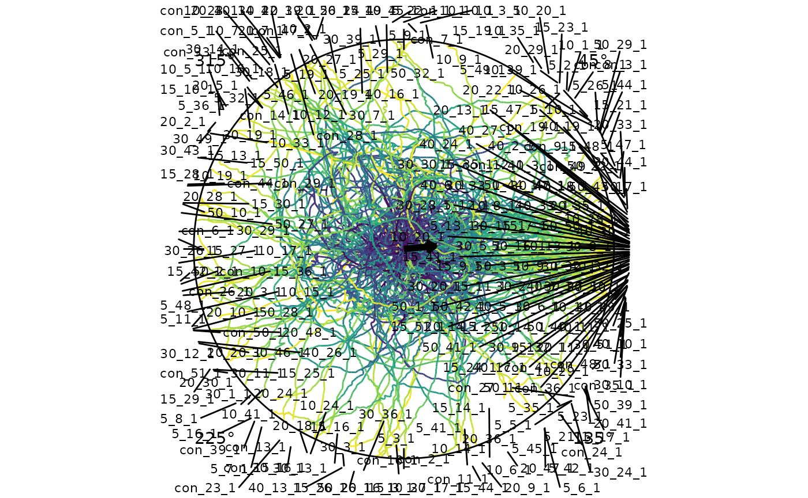

### Representing time

Attach a capture **frame rate** (frames per second) to a `Tracks` object
and the time aspect of frame-indexed tracks can be reported in real
seconds and shown on the plot. The frame rate is stored in the object’s
metadata; the time/frame column itself is never altered.
[`track_duration()`](https://johnkirwan.github.io/radiatR/reference/track_duration.md)
reports the elapsed seconds of each trajectory, and
`track_colour = "time"` colours each path by elapsed time (POSIXct time
works without a frame rate).

``` r

# attach a capture rate, then represent the time aspect
ts <- set_frame_rate(cpunctatus, fps = 30)
head(track_duration(ts))                                 # seconds per track
#>        id  duration
#> 1  10_1_1 2.6666667
#> 2 10_10_1 9.9333333
#> 3 10_11_1 2.1333333
#> 4 10_12_1 1.5666667
#> 5 10_13_1 2.6333333
#> 6 10_14_1 0.9666667
radiate(ts, show_tracks = TRUE, track_colour = "time")   # colour by elapsed time
#> Warning: Removed 105 rows containing missing values or values outside the scale range
#> (`geom_path()`).
```

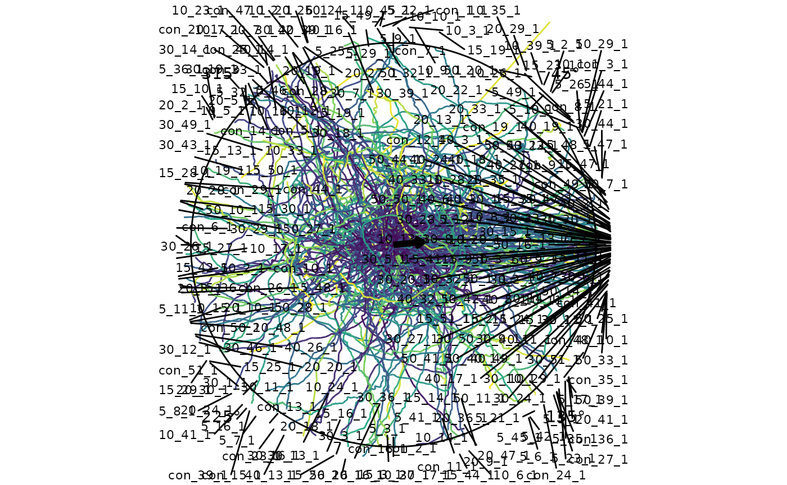

A frame rate also lets
[`track_speed()`](https://johnkirwan.github.io/radiatR/reference/track_speed.md)
report each trajectory’s speed in real units. With the default
unit-circle coordinates that is radii per second.

``` r

# speed in radii per second once a frame rate is set
ts <- set_frame_rate(cpunctatus, fps = 30)
head(track_speed(ts))            # mean speed per track
#>         trial_id     speed
#> 10_1_1    10_1_1 0.5117093
#> 10_10_1  10_10_1 0.8797423
#> 10_11_1  10_11_1 0.5992307
#> 10_12_1  10_12_1 0.7900211
#> 10_13_1  10_13_1 0.6047888
#> 10_14_1  10_14_1 0.9688229
head(track_speed(ts, stat = "max"))
#>         trial_id     speed
#> 10_1_1    10_1_1 0.9965993
#> 10_10_1  10_10_1 2.6559596
#> 10_11_1  10_11_1 1.3979594
#> 10_12_1  10_12_1 1.2717587
#> 10_13_1  10_13_1 1.3794944
#> 10_14_1  10_14_1 1.4268880
```

The same frame rate lets
[`radiate()`](https://johnkirwan.github.io/radiatR/reference/radiate.md)
colour each path by its instantaneous speed, the per-observation sibling
of
[`track_speed()`](https://johnkirwan.github.io/radiatR/reference/track_speed.md).

``` r

# colour each path by its instantaneous speed (needs a frame rate)
ts <- set_frame_rate(cpunctatus, fps = 30)
radiate(ts, show_tracks = TRUE, track_colour = "speed")
#> Warning: Removed 105 rows containing missing values or values outside the scale range
#> (`geom_path()`).
```

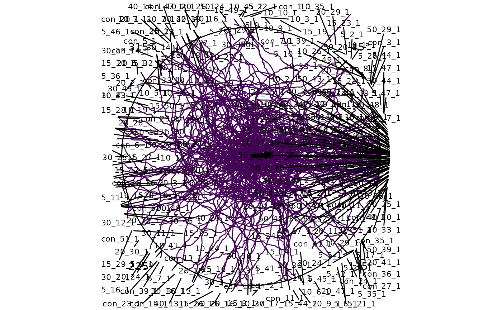

If you know a physical scale, calibrate distances so lengths and speeds
report in real units. The scale is physical units per coordinate unit
(e.g. mm per radius); unset, everything stays in coordinate units
(radii).

``` r

# calibrate distance (optional): 50 mm per coordinate unit (radius)
ts <- set_distance_scale(set_frame_rate(cpunctatus, 30), 50, unit = "mm")
head(track_length(ts))      # path length per track, in mm
#>         trial_id    length
#> 10_1_1    10_1_1  68.22790
#> 10_10_1  10_10_1 436.93869
#> 10_11_1  10_11_1  63.91794
#> 10_12_1  10_12_1  61.88499
#> 10_13_1  10_13_1  79.63053
#> 10_14_1  10_14_1  46.82644
head(track_speed(ts))       # mean speed per track, in mm/s
#>         trial_id    speed
#> 10_1_1    10_1_1 25.58546
#> 10_10_1  10_10_1 43.98712
#> 10_11_1  10_11_1 29.96154
#> 10_12_1  10_12_1 39.50105
#> 10_13_1  10_13_1 30.23944
#> 10_14_1  10_14_1 48.44115
# or from two measured landmarks:
# ts <- calibrate_distance(ts, coord_distance = 0.8, real_distance = 40, unit = "mm")
```

A frame rate also unlocks per-observation kinematics:
[`velocity_vector()`](https://johnkirwan.github.io/radiatR/reference/velocity_vector.md)
gives the velocity components (`vx`, `vy`; distance-calibrated when a
scale is set) and
[`angular_velocity()`](https://johnkirwan.github.io/radiatR/reference/angular_velocity.md)
the signed turning rate (counter-clockwise positive).

``` r

# velocity components and turning rate (need a frame rate; vx/vy use the distance scale)
ts <- set_frame_rate(cpunctatus, fps = 30)
head(velocity_vector(ts))                 # vx, vy per observation
#>           vx         vy
#> 1         NA         NA
#> 2  0.2309549  0.2309549
#> 3 -0.2309549  0.0000000
#> 4 -0.1533230  0.0000000
#> 5  0.1533230 -0.6909238
#> 6  0.3076164 -0.4599689
head(angular_velocity(ts, units = "degrees"))   # turning rate, deg/s (CCW +)
#> [1]        NA 4050.0000    0.0000 3075.3530  637.8571    0.0000
```

[`velocity_angle()`](https://johnkirwan.github.io/radiatR/reference/velocity_angle.md)
gives the direction of travel at each observation, in the same
convention as headings — so it feeds straight into the circular tools:

``` r

ts <- set_frame_rate(cpunctatus, fps = 30)
head(velocity_angle(ts, units = "degrees"))   # movement direction per observation
#> [1]       NA  45.0000 180.0000 180.0000 282.5118 303.7737
```

Reduced to one row per track,
[`track_velocity()`](https://johnkirwan.github.io/radiatR/reference/track_velocity.md)
gives each path’s net (average) velocity vector and
[`track_turning()`](https://johnkirwan.github.io/radiatR/reference/track_turning.md)
summarises its turning rate.

``` r

# per-track summaries (need a frame rate; velocity uses the distance scale)
ts <- set_frame_rate(cpunctatus, fps = 30)
head(track_velocity(ts))                       # net velocity vector (vx, vy) per track
#>         trial_id           vx          vy
#> 10_1_1    10_1_1  0.244467664  0.27514439
#> 10_10_1  10_10_1  0.001745265 -0.08705181
#> 10_11_1  10_11_1  0.072856469  0.47347488
#> 10_12_1  10_12_1 -0.411668880  0.50517999
#> 10_13_1  10_13_1  0.000000000 -0.38637420
#> 10_14_1  10_14_1 -0.461499359  0.78038925
head(track_turning(ts, units = "degrees"))     # typical turning rate (deg/s) per track
#>         trial_id   turning
#> 10_1_1    10_1_1 1122.7526
#> 10_10_1  10_10_1  603.2629
#> 10_11_1  10_11_1 1019.2704
#> 10_12_1  10_12_1  878.3579
#> 10_13_1  10_13_1  913.2823
#> 10_14_1  10_14_1  351.5319
```

For a non-circular view,
[`plot_profile()`](https://johnkirwan.github.io/radiatR/reference/plot_profile.md)
draws a per-observation kinematics metric — instantaneous speed or
turning rate — against elapsed time, one line per track. It is the
ggplot sibling of
[`radiate()`](https://johnkirwan.github.io/radiatR/reference/radiate.md).

``` r

# speed (or turning rate) along each track over time
ts <- set_frame_rate(cpunctatus, fps = 30)
plot_profile(ts, metric = "speed")
```

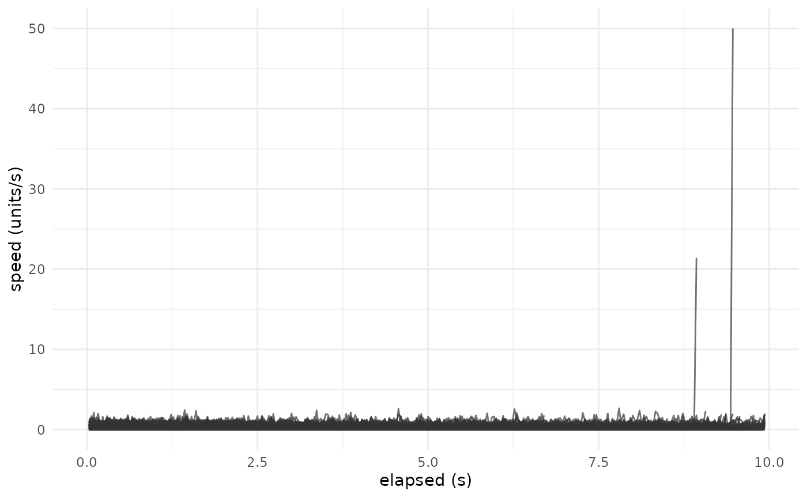

``` r

plot_profile(ts, metric = "turning", units = "degrees")
```

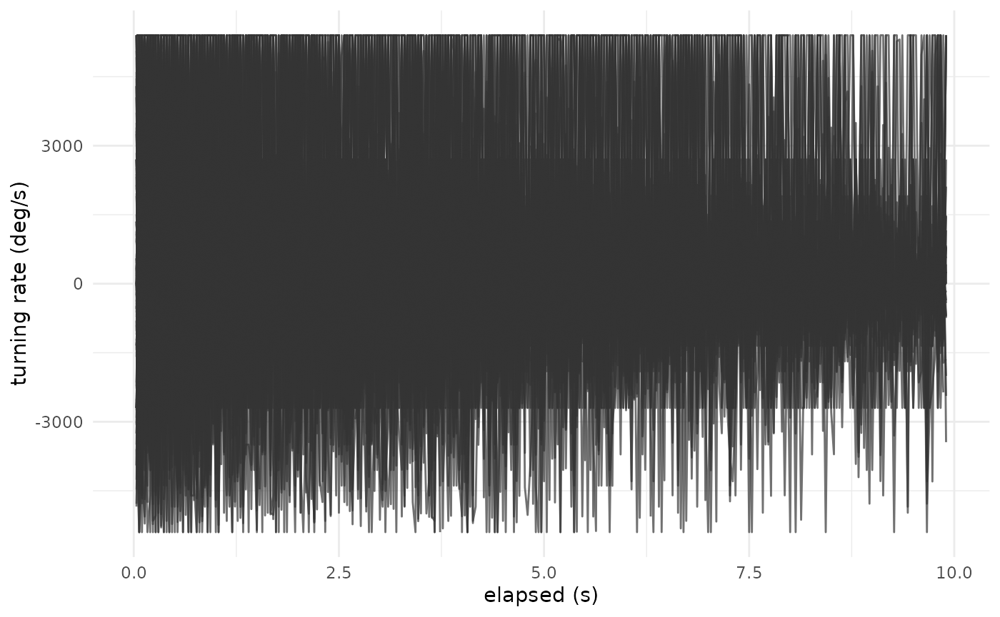

`metric = "direction"` plots the movement direction over time (as
points, since direction is circular):

``` r

plot_profile(ts, metric = "direction", units = "degrees")
```

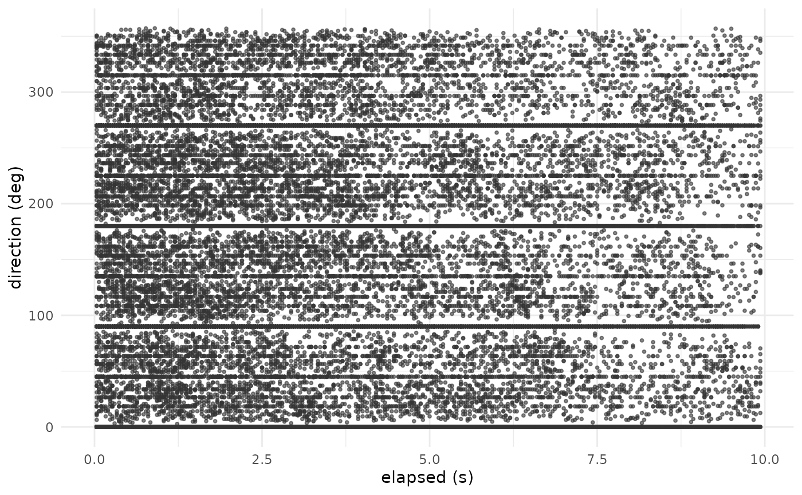

[`plot_speed_direction()`](https://johnkirwan.github.io/radiatR/reference/plot_speed_direction.md)
crosses the two — each observation’s speed against its movement
direction. The speed axis is robustly clipped by default so a few
single-frame tracking artifacts do not crush the display:

``` r

plot_speed_direction(ts)
```

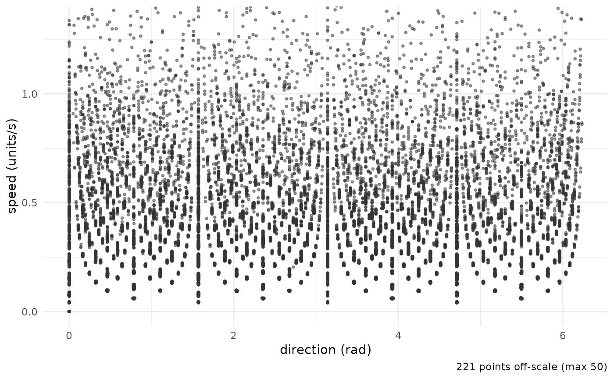

The pooled speed distribution, with median and CV, comes from
[`plot_speed_histogram()`](https://johnkirwan.github.io/radiatR/reference/plot_speed_histogram.md):

``` r

plot_speed_histogram(ts)
```

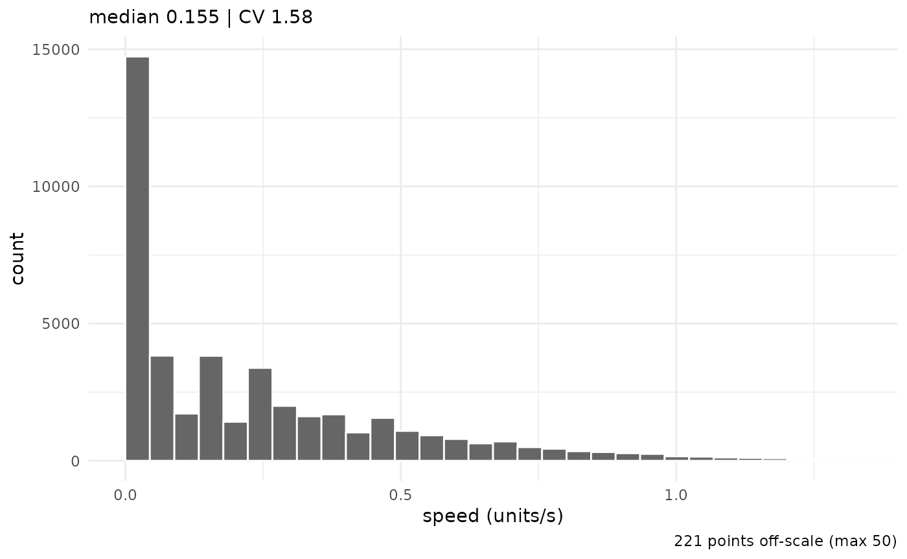

## Heading Overlays

The **crossing method** — projecting the vector between two
concentric-ring crossings to the unit circle — assigns one directional
heading per trial.
[`derive_headings()`](https://johnkirwan.github.io/radiatR/reference/derive_headings.md)
with `return_coords = TRUE` returns both the heading angle and the
inner-ring crossing position.

``` r

hd <- derive_headings(cpunctatus, rule = "crossing",
                      circ0 = 0.2, circ1 = 0.4,
                      return_coords = TRUE)
#> Warning: derive_headings(rule = 'crossing'): 25 of 251 trials (10.0%) produced
#> no heading and are excluded from circular statistics. Rule-based failures are
#> often non-random and can bias results; inspect attr(x, "missing_ids").
names(hd)[names(hd) == "id"] <- "trial_id"
# join the target half-width (arc) from the dataset for grouping/faceting
arc_map <- unique(cpunctatus@data[, c("trial_id", "arc")])
hd       <- merge(hd, arc_map, by = "trial_id")
hd$arc   <- factor(hd$arc)
attr(hd, "colour_col") <- "arc"
attr(hd, "display")    <- circ_display(zero = 0)
head(hd[, c("trial_id", "arc", "heading", "x_inner", "y_inner")])
#>   trial_id arc   heading     x_inner     y_inner
#> 1   10_1_1  10 0.3545811  0.19556350 -0.04102813
#> 2  10_10_1  10 6.2337825 -0.03715972  0.19558015
#> 3  10_11_1  10 1.3353505 -0.07231344  0.18624466
#> 4  10_12_1  10 2.2846471 -0.18291981  0.08084798
#> 5  10_13_1  10 5.6521348  0.18223038  0.08232129
#> 6  10_14_1  10 1.6589765  0.09025066  0.17836615
```

Overlaying the heading endpoints (one hollow circle per trial) and the
grand mean direction on the combined trajectory plot gives a compact
summary of the full dataset:

``` r

p_all <- radiate(cpunctatus,
                 group_col   = "trial_id",
                 colour_col  = "arc",
                 show_labels = FALSE,
                 show_arrow  = FALSE,
                 display     = circ_display(zero = 0)) +
  add_heading_points(hd, colour_col = "arc", size = 1, alpha = 0.6)

p_all + add_heading_arrow(hd)
#> Warning: Removed 105 rows containing missing values or values outside the scale range
#> (`geom_path()`).
#> Warning: Removed 25 rows containing missing values or values outside the scale range
#> (`geom_point()`).
```

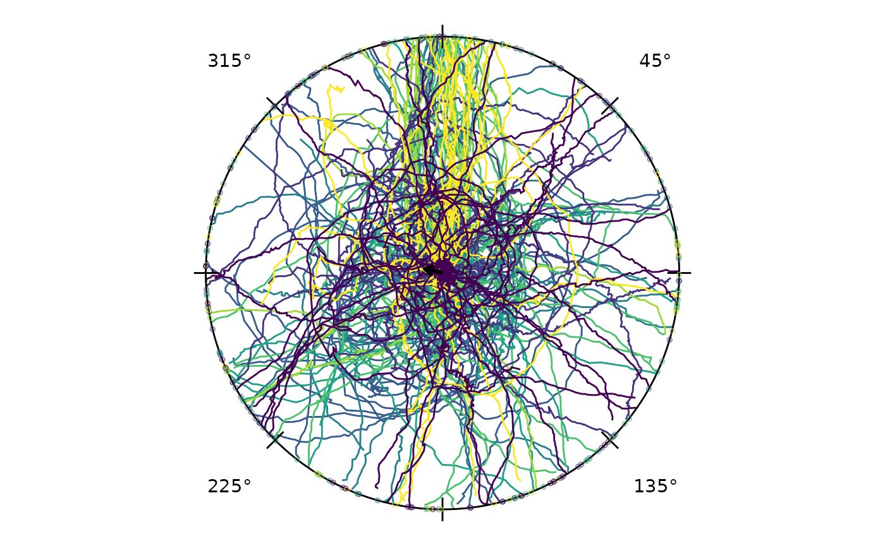

The grand mean arrow points at 283.2° relative to the reference
direction (clock convention; 0° = toward reference) with *R* = 0.08,
reflecting the overall reference-relative tendency across all
conditions.

## Circular Interval Arc

Three functions handle directional uncertainty arcs in parallel with the
density overlay functions:

| Function | Role |
|----|----|
| [`compute_circ_interval()`](https://johnkirwan.github.io/radiatR/reference/compute_circ_interval.md) | Computes arc bounds from raw headings; returns a data frame with `lower`, `upper`, `mean_dir`, and `wraps` |
| [`add_circ_interval()`](https://johnkirwan.github.io/radiatR/reference/add_circ_interval.md) | Renders any bounds data frame as an arc at a configurable radius — agnostic to how the bounds were produced |
| [`add_heading_interval()`](https://johnkirwan.github.io/radiatR/reference/add_heading_interval.md) | Convenience wrapper: calls the two above in sequence |

Two statistics are supported: `stat = "bootstrap_ci"` bootstraps the von
Mises MLE confidence interval for the mean direction; `stat = "sd"`
draws a ±1 circular SD arc. The split design lets you substitute
Bayesian credible bounds into the data frame before rendering:

``` r

iv <- compute_circ_interval(hd, group_col = "arc", stat = "bootstrap_ci")
# replace with Bayesian posteriors: iv$lower <- ...; iv$upper <- ...
add_circ_interval(iv, colour_col = "arc")
```

## Building Up a Panel

Layers compose with the standard `ggplot2` `+` operator, so a plot can
be assembled feature by feature. The four chunks below start from
trajectories only and add heading endpoints, the grand mean arrow, and
finally a bootstrap CI arc.

**Trajectories:**

``` r

p <- radiate(cpunctatus,
             group_col   = "trial_id",
             colour_col  = "arc",
             show_labels = FALSE,
             show_arrow  = FALSE,
             display     = circ_display(zero = 0))
p
#> Warning: Removed 105 rows containing missing values or values outside the scale range
#> (`geom_path()`).
```

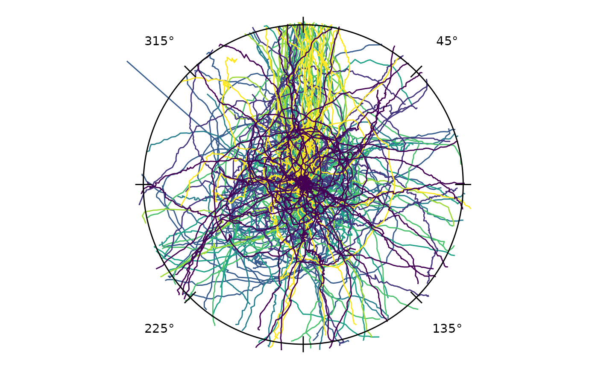

**+ Heading endpoints** at each trial’s crossing location:

``` r

p <- p + add_heading_points(hd, colour_col = "arc", size = 1.5, alpha = 0.7)
p
#> Warning: Removed 105 rows containing missing values or values outside the scale range
#> (`geom_path()`).
#> Warning: Removed 25 rows containing missing values or values outside the scale range
#> (`geom_point()`).
```


**+ Grand mean direction arrow:**

``` r

p <- p + add_heading_arrow(hd)
p
#> Warning: Removed 105 rows containing missing values or values outside the scale range
#> (`geom_path()`).
#> Warning: Removed 25 rows containing missing values or values outside the scale range
#> (`geom_point()`).
```


The arc at radius 1.05 spans the 95 % bootstrap confidence interval for
the grand mean direction pooled across all arc conditions.

## Circular Boxplot

[`add_circular_boxplot()`](https://johnkirwan.github.io/radiatR/reference/add_circular_boxplot.md)
overlays a Tukey-like boxplot for circular data (Buttarazzi, Pandolfo &
Porzio, 2018): the box spans the central 50 % around the circular
median, whiskers reach a concentration-adjusted fence, and far-out
values are marked individually. It composes onto a
[`radiate()`](https://johnkirwan.github.io/radiatR/reference/radiate.md)
plot like the other overlay helpers.

``` r

radiate(cpunctatus) + add_circular_boxplot(hd)
#> Warning: Removed 105 rows containing missing values or values outside the scale range
#> (`geom_path()`).
```

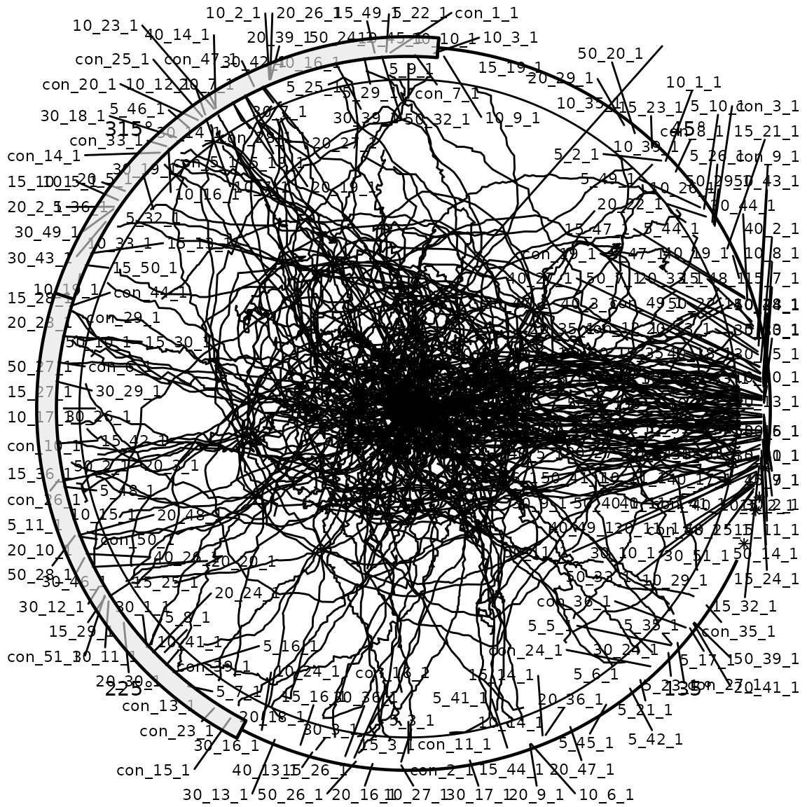

[`circ_boxplot_stats()`](https://johnkirwan.github.io/radiatR/reference/circ_boxplot_stats.md)
returns the underlying numeric summary — the circular median, box
hinges, fences, far-out values, and the closed-form von Mises fence
multiplier — so the boxplot can be inspected or reproduced independently
of the plot:

``` r

circ_boxplot_stats(hd)$constant
#> [1] 0.5995206
```

The boxplot is not recommended for uniform or multimodal data: with no
clear central direction the box spans roughly half the circle and the
summary is uninformative.
[`circ_boxplot_stats()`](https://johnkirwan.github.io/radiatR/reference/circ_boxplot_stats.md)
flags such cases via its `drawable` and `reason` fields, and
[`add_circular_boxplot()`](https://johnkirwan.github.io/radiatR/reference/add_circular_boxplot.md)
emits a warning rather than drawing a misleading box. Position-based
axial data is supported via `axial = TRUE`, which draws the box and
whiskers at both poles of the median axis.

## Colour Options

Three strategies control how trajectories are coloured.

**Option 1 — single colour.** Pass a colour string directly to the
heading-overlay helpers; omit `colour_col` from
[`radiate()`](https://johnkirwan.github.io/radiatR/reference/radiate.md)
to draw all tracks in the default grey.

**Option 2 — cycling palette.** `colour_cycle` assigns each trajectory a
colour index that cycles back to 1 after every *n* trajectories. When
`facets` is set the cycle restarts independently within each panel so
that trajectory 1 in every panel always gets colour 1. Pass an integer
for automatic palette assignment, or a character vector to specify
colours explicitly.

**Option 3 — variable mapping.** `colour_col` maps any data column to
colour (e.g. the `arc` factor used in the combined-trajectory plot
above).

## Per-Condition Panels

Faceting by arc angle shows each condition separately. Within each
panel,
[`assign_cycle_colours()`](https://johnkirwan.github.io/radiatR/reference/assign_cycle_colours.md)
distinguishes individual trajectories by cycling through 10 colours,
resetting at each panel boundary. Calling it explicitly on both the
track data and the headings data frame (joining by trial id) means
heading markers inherit the exact per-trajectory colour — not a single
per-condition colour — when `colour_col` is used for both.

``` r

# Pre-compute cycling colours: 10 colours, restarting within each arc panel.
# Join to headings so heading layers can use the same column.
cpunctatus_cc        <- cpunctatus
cpunctatus_cc@data   <- assign_cycle_colours(cpunctatus@data,
                                            id_col    = "trial_id",
                                            n         = 10,
                                            panel_col = "arc")
colour_map <- unique(cpunctatus_cc@data[, c("trial_id", "cycle_colour")])
hd_cc      <- merge(hd, colour_map,
                    by      = "trial_id", all.x = TRUE)
attr(hd_cc, "display")    <- attr(hd, "display", exact = TRUE)
attr(hd_cc, "colour_col") <- "cycle_colour"
```

``` r

p <- radiate(cpunctatus_cc,
        group_col    = "trial_id",
        colour_col   = "cycle_colour",
        facets     = "arc",
        ncol         = 3,
        show_labels  = FALSE,
        show_arrow   = FALSE,
        display      = circ_display(zero = 0))
p
#> Warning: Removed 105 rows containing missing values or values outside the scale range
#> (`geom_path()`).
```

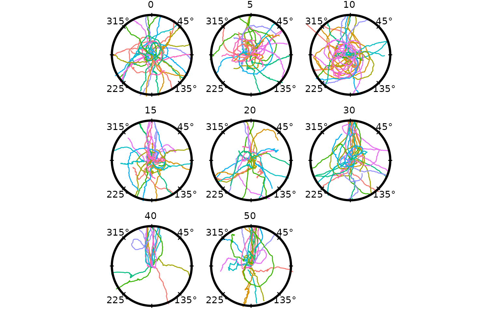

For a two-way layout, `rows` and `cols` facet into a grid via
[`ggplot2::facet_grid()`](https://ggplot2.tidyverse.org/reference/facet_grid.html)
(mirroring ggplot — each takes one or more columns):

``` r

radiate(cpunctatus, group_col = "trial_id", rows = "type", cols = "arc")
```

Use `rows`/`cols` (grid) or `facets` (wrap), not both.

**+ Bootstrap CI arc** added first so it sits behind heading markers:

``` r

p <- p + add_heading_interval(hd_cc, group_col = "arc", colour = "black",
                               stat = "bootstrap_ci", boot_reps = 999L)
p
#> Warning: Removed 105 rows containing missing values or values outside the scale range
#> (`geom_path()`).
```

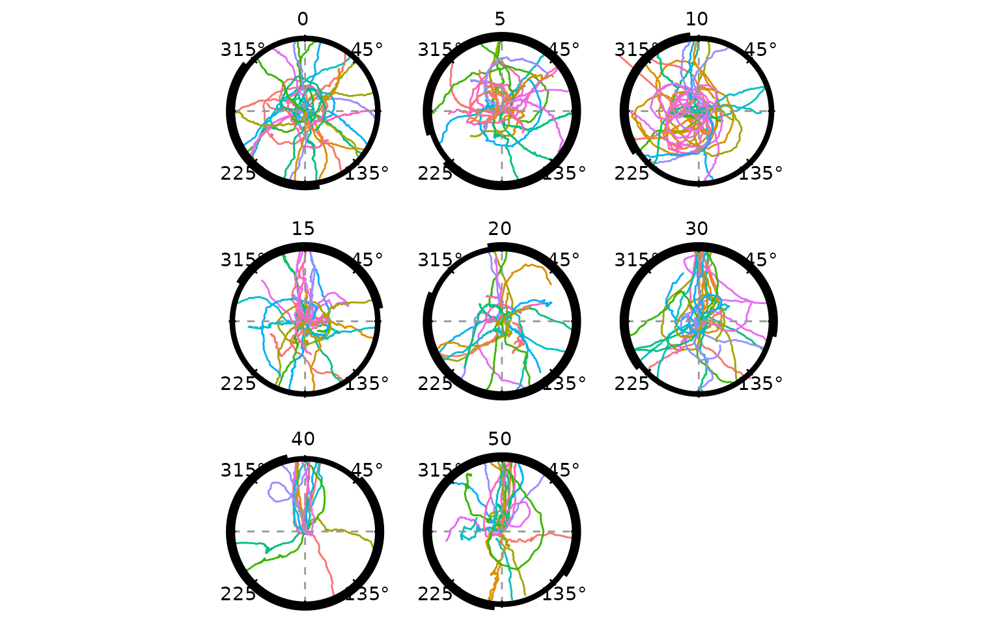

**+ Heading vectors** (dotted lines from inner crossing to the
circumference):

``` r

p <- p + add_heading_vectors(hd_cc)
p
#> Warning: Removed 105 rows containing missing values or values outside the scale range
#> (`geom_path()`).
#> Warning: Removed 25 rows containing missing values or values outside the scale range
#> (`geom_segment()`).
```

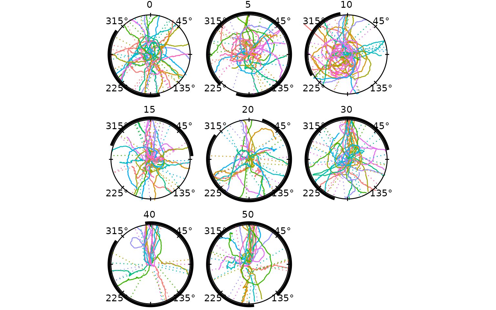

**+ Heading points** on top of the CI arc:

``` r

p <- p + add_heading_points(hd_cc, size = 4)
p
#> Warning: Removed 105 rows containing missing values or values outside the scale range
#> (`geom_path()`).
#> Warning: Removed 25 rows containing missing values or values outside the scale range
#> (`geom_segment()`).
#> Warning: Removed 25 rows containing missing values or values outside the scale range
#> (`geom_point()`).
```

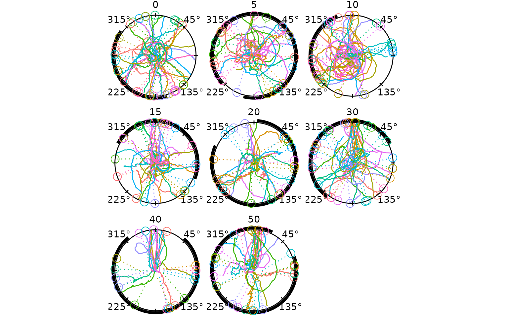

``` r

p <- p + add_heading_arrow(hd_cc, colour_col = "arc", colour = "black")
p
#> Warning: Removed 105 rows containing missing values or values outside the scale range
#> (`geom_path()`).
#> Warning: Removed 25 rows containing missing values or values outside the scale range
#> (`geom_segment()`).
#> Warning: Removed 25 rows containing missing values or values outside the scale range
#> (`geom_point()`).
```

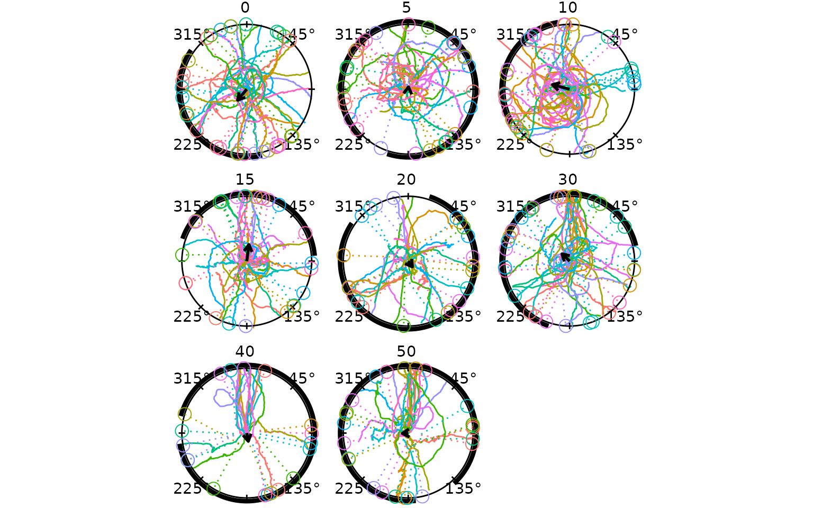

Each panel shows trajectories and heading markers coloured by
per-trajectory cycling palette, a bootstrap CI arc at radius 1.05 in the
condition colour (rendered behind the heading points), a solid mean
direction arrow, and degree labels. All in clock convention (0° = toward
reference, clockwise). Use `strip_position = "inside"` to place the
label inside the plot area, or `strip_labels = FALSE` to suppress it.

## Circular Density Overlays

Three functions handle directional density overlays; they are designed
to compose cleanly with any density source:

| Function | Role |
|----|----|
| [`compute_circular_density()`](https://johnkirwan.github.io/radiatR/reference/compute_circular_density.md) | Estimates density from raw headings; returns a plain data frame of `(theta, density)` pairs |
| [`add_circular_density()`](https://johnkirwan.github.io/radiatR/reference/add_circular_density.md) | Renders any `(theta, density)` data frame as a radial overlay — agnostic to how the density was produced |
| [`add_heading_density()`](https://johnkirwan.github.io/radiatR/reference/add_heading_density.md) | Convenience wrapper: calls the two above in sequence |

Three built-in methods are available in
[`compute_circular_density()`](https://johnkirwan.github.io/radiatR/reference/compute_circular_density.md):
`"vonmises"` (MLE via
[`circular::mle.vonmises()`](https://rdrr.io/pkg/circular/man/mle.vonmises.html)),
`"kernel"` (circular KDE), and `"histogram"` (bin counts). Because the
computation and rendering steps are separate, the `density` column can
be replaced with values from any other model — including a Bayesian
posterior predictive density from `brms` — before calling
[`add_circular_density()`](https://johnkirwan.github.io/radiatR/reference/add_circular_density.md):

``` r

dens_df <- compute_circular_density(hd, colour_col = "arc", method = "vonmises")
# replace with Bayesian posterior: dens_df$density <- my_brms_fitted_density(dens_df$theta)
add_circular_density(dens_df, colour_col = "arc", fill = "grey80", alpha = 0.35)
```

The convenience wrapper
[`add_heading_density()`](https://johnkirwan.github.io/radiatR/reference/add_heading_density.md)
skips the intermediate step when no substitution is needed. The combined
panel plot below uses it to shade a per-condition von Mises density
alongside the heading vectors:

``` r

radiate(cpunctatus_cc,
        group_col    = "trial_id",
        colour_col   = "cycle_colour",
        facets     = "arc",
        ncol         = 3,
        show_labels  = FALSE,
        show_arrow   = FALSE,
        display      = circ_display(zero = 0)) +
  add_heading_density(hd_cc, colour_col = "arc",
                      method = "vonmises", scale = 0.4,
                      fill = "grey80", alpha = 0.35) +
  add_heading_vectors(hd_cc) +
  add_heading_arrow(hd_cc, colour_col = "arc", colour = "black")
#> Warning: Removed 105 rows containing missing values or values outside the scale range
#> (`geom_path()`).
#> Warning: Removed 25 rows containing missing values or values outside the scale range
#> (`geom_segment()`).
```

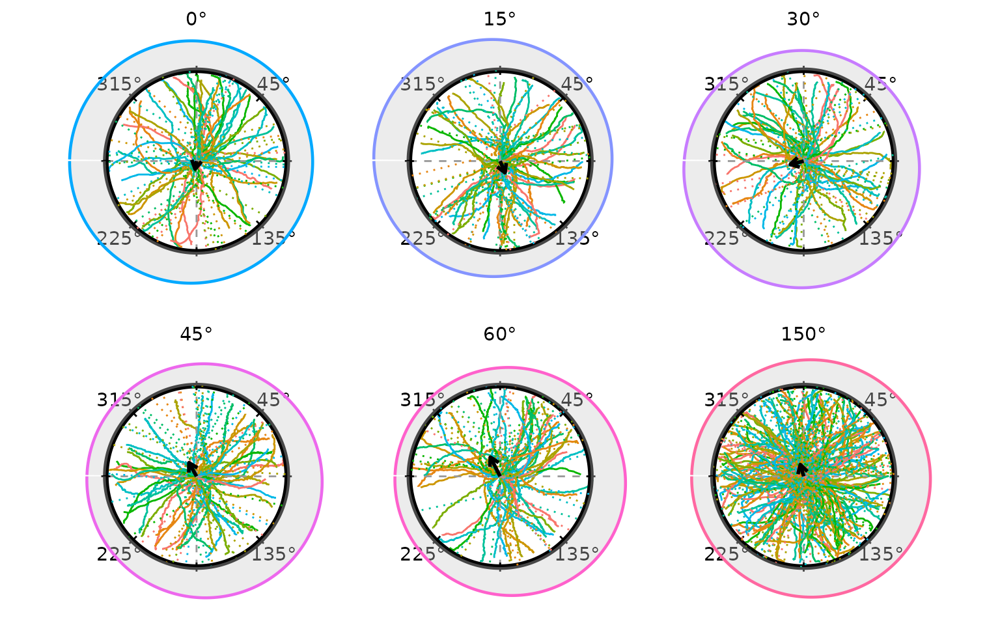

The shaded region is the von Mises density fitted to the crossing
headings within each arc condition. A narrower, taller peak indicates
more concentrated directional responses. Switch to `method = "kernel"`
for a non-parametric estimate, or `method = "histogram"` for a raw count
display.

## Bootstrap Confidence Band

[`compute_circular_density()`](https://johnkirwan.github.io/radiatR/reference/compute_circular_density.md)
with `boot_reps > 0` runs a non-parametric bootstrap: heading samples
are drawn with replacement, a von Mises MLE is fitted to each replicate,
and the density is re-evaluated on the same angular grid. The
`boot_alpha / 2` and `1 - boot_alpha / 2` quantiles across replicates
become `density_lower` and `density_upper` columns, which
[`add_circular_density()`](https://johnkirwan.github.io/radiatR/reference/add_circular_density.md)
renders as a shaded band around the fitted curve.

``` r

dens_boot <- compute_circular_density(hd, colour_col = "arc",
                                      method = "vonmises",
                                      boot_reps = 499L, boot_alpha = 0.05,
                                      n_theta = 300L)

radiate(cpunctatus,
        group_col    = "trial_id",
        colour_cycle = 10,
        facets     = "arc",
        ncol         = 3,
        show_labels  = FALSE,
        show_arrow   = FALSE,
        display      = circ_display(zero = 0)) +
  add_circular_density(dens_boot, colour_col = "arc",
                       scale = 0.4, fill = "grey80", alpha = 0.35,
                       ci_fill = "grey60", ci_alpha = 0.35) +
  add_heading_arrow(hd, colour_col = "arc", colour = "black")
#> Warning: Removed 105 rows containing missing values or values outside the scale range
#> (`geom_path()`).
```

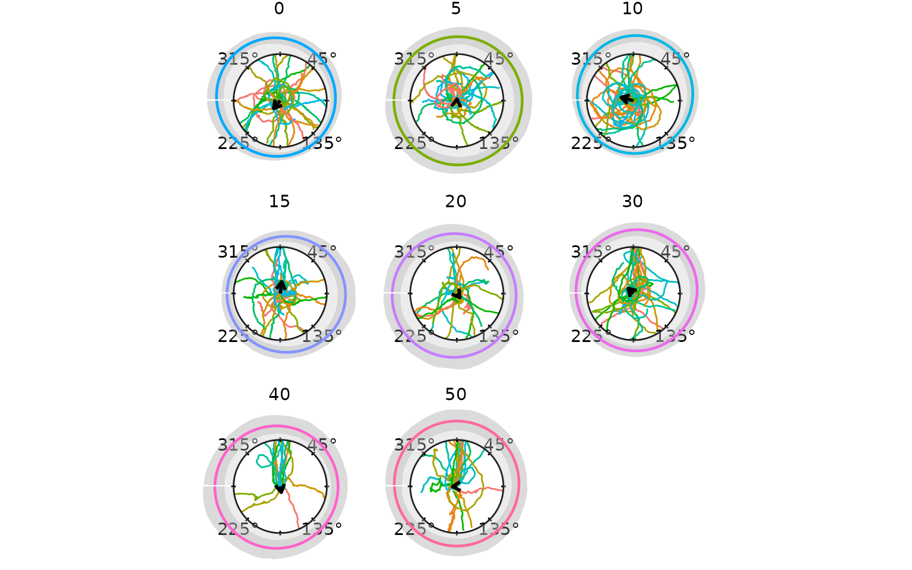

The darker band is the 95% bootstrap confidence interval for the fitted
von Mises density. A wider band reflects greater parametric uncertainty,
typically seen in the smaller or more diffuse conditions. The
`density_lower` and `density_upper` columns in `dens_boot` can be
replaced with interval values from a Bayesian model (e.g. the 2.5th and
97.5th percentiles of a `brms` posterior predictive distribution) before
passing to
[`add_circular_density()`](https://johnkirwan.github.io/radiatR/reference/add_circular_density.md).

## Circular Summary Statistics

[`compute_circ_mean()`](https://johnkirwan.github.io/radiatR/reference/compute_circ_mean.md)
returns the per-condition statistics behind the arrows above:

``` r

compute_circ_mean(hd, group_col = "arc")[, c("arc", "mean_dir", "resultant_R")]
#>   arc  mean_dir resultant_R
#> 1  10 1.3122762  0.27298867
#> 2  15 6.1535219  0.25745294
#> 3  20 3.7683984  0.10968390
#> 4  30 0.8051961  0.16285026
#> 5  40 3.3258479  0.12904693
#> 6   5 6.1710354  0.03518184
#> 7  50 1.6405047  0.09148952
#> 8   0 2.4441971  0.21852376
```

For within-trial path consistency (tortuosity),
[`circ_summary()`](https://johnkirwan.github.io/radiatR/reference/circ_summary.md)
operates on the step-by-step angle distribution:

``` r

circ_summary(ts_demo)
#>           id   n t_start t_end   mean_dir resultant_R kappa
#> 1     10_1_1  81       1    81 0.11601277  0.83986765    NA
#> 2    10_10_1 299       1   299 2.27816423  0.15483083    NA
#> 3    10_11_1  65      14    78 0.25433201  0.66719920    NA
#> 4    10_12_1  48       2    49 2.30699848  0.90377927    NA
#> 5    10_13_1  80      22   101 0.96510683  0.53748429    NA
#> 6    10_14_1  30       1    30 4.76335993  0.97186701    NA
#> 7    10_15_1  54       2    55 3.52077381  0.93703586    NA
#> 8    10_16_1  78       2    79 3.07994139  0.75350741    NA
#> 9    10_17_1  47       1    47 3.57548520  0.96788712    NA
#> 10   10_19_1 282      18   299 1.95265552  0.37352800    NA
#> 11    10_2_1  48       1    48 2.38407618  0.92287205    NA
#> 12   10_20_1 257      35   291 3.28735826  0.06865973    NA
#> 13   10_23_1 285      15   299 3.17651959  0.95049488    NA
#> 14   10_24_1 299       1   299 4.41001073  0.99114749    NA
#> 15   10_26_1 297       3   299 0.56922008  0.98833710    NA
#> 16   10_27_1 287      13   299 1.27801742  0.17608487    NA
#> 17   10_28_1  70       1    70 0.24722515  0.99017916    NA
#> 18   10_29_1 160      33   192 5.88168170  0.89922506    NA
#> 19    10_3_1 113       1   113 2.82658773  0.36596253    NA
#> 20   10_33_1 292       8   299 2.63078292  0.99680196    NA
#> 21   10_35_1 285      15   299 3.71725585  0.98345748    NA
#> 22   10_39_1 209       8   216 1.74020125  0.87543282    NA
#> 23   10_41_1 246      54   299 4.40674054  0.66683690    NA
#> 24   10_45_1 297       3   299 1.94073553  0.96305715    NA
#> 25    10_5_1  60       2    61 1.94603101  0.71894766    NA
#> 26    10_6_1  91       1    91 5.38407117  0.73923539    NA
#> 27    10_7_1  56       1    56 3.03029422  0.81454694    NA
#> 28    10_8_1  87       1    87 0.28440324  0.98625686    NA
#> 29    10_9_1 299       1   299 1.28909699  0.44454476    NA
#> 30   15_10_1 299       1   299 2.55980784  0.94235363    NA
#> 31   15_11_1 299       1   299 6.22819541  0.99982898    NA
#> 32   15_13_1  86       1    86 2.34142569  0.97038308    NA
#> 33   15_14_1 299       1   299 4.50120997  0.96268696    NA
#> 34   15_16_1 299       1   299 2.22838041  0.05176624    NA
#> 35   15_19_1 136       1   136 1.49830203  0.97451676    NA
#> 36    15_2_1 298       2   299 3.78567731  0.56143361    NA
#> 37   15_21_1 299       1   299 0.30348015  0.99696169    NA
#> 38   15_23_1 299       1   299 5.46169359  0.50809640    NA
#> 39   15_24_1 299       1   299 6.01136043  0.99737845    NA
#> 40   15_25_1 201      15   215 3.49231678  0.24577237    NA
#> 41   15_26_1 180       4   183 4.59130526  0.99325588    NA
#> 42   15_27_1 299       1   299 3.27544567  0.51244674    NA
#> 43   15_28_1 205       1   205 2.51823083  0.94955008    NA
#> 44   15_29_1 181       1   181 1.40296402  0.30838298    NA
#> 45    15_3_1 263      20   282 4.14828843  0.90299967    NA
#> 46   15_30_1 280       1   280 2.98748265  0.99798753    NA
#> 47   15_32_1 299       1   299 5.96415656  0.98966372    NA
#> 48   15_35_1 233       1   233 0.20853032  0.78788735    NA
#> 49   15_36_1 299       1   299 2.77136926  0.47808052    NA
#> 50   15_41_1 192       6   197 0.45932573  0.94218791    NA
#> 51   15_42_1  92       1    92 3.50831648  0.97564825    NA
#> 52   15_44_1 225       7   231 3.10874826  0.32496901    NA
#> 53   15_47_1 225       1   225 0.17240450  0.99548491    NA
#> 54   15_48_1 225       1   225 0.18326845  0.99518116    NA
#> 55   15_49_1 299       1   299 1.67764329  0.99937551    NA
#> 56   15_50_1 299       1   299 1.07588619  0.42856981    NA
#> 57   15_51_1 181       1   181 6.13306449  0.99791415    NA
#> 58    15_7_1 175       3   177 0.24885314  0.98512977    NA
#> 59    15_9_1 279       3   281 5.14054126  0.72395950    NA
#> 60   20_10_1 299       1   299 3.90847302  0.95728614    NA
#> 61   20_11_1 284       8   291 5.65755647  0.77852741    NA
#> 62   20_13_1 287       2   288 4.01880340  0.62800624    NA
#> 63   20_14_1 135       1   135 0.25507384  0.97496332    NA
#> 64   20_16_1 216       8   223 5.39642116  0.92479381    NA
#> 65   20_18_1 283       2   284 5.04291139  0.71006271    NA
#> 66   20_19_1  78      21    98 1.79807786  0.97876779    NA
#> 67    20_2_1 227       1   227 1.51703975  0.89133744    NA
#> 68   20_20_1  85       1    85 2.68502012  0.75287781    NA
#> 69   20_22_1 299       1   299 0.18918312  0.97859808    NA
#> 70   20_24_1 299       1   299 4.19233539  0.97193537    NA
#> 71   20_26_1 274       7   280 3.01169447  0.50723092    NA
#> 72   20_27_1  84      10    93 2.90554888  0.65560451    NA
#> 73   20_28_1 246       5   250 2.64039413  0.94119258    NA
#> 74   20_29_1  41      59    99 0.92989363  0.95902177    NA
#> 75    20_3_1 241      43   283 4.13256041  0.62193439    NA
#> 76   20_30_1 299       1   299 4.06111336  0.99762883    NA
#> 77   20_33_1 105      40   144 0.42291825  0.95171682    NA
#> 78   20_35_1 299       1   299 0.06807526  0.99863680    NA
#> 79   20_36_1 274       1   274 0.95650996  0.51392567    NA
#> 80   20_39_1  71      81   151 2.29183469  0.93249560    NA
#> 81   20_41_1 202      50   251 6.19127720  0.96381695    NA
#> 82   20_47_1 120      62   181 5.04036796  0.31089917    NA
#> 83   20_48_1 110      16   125 3.55333429  0.91803621    NA
#> 84    20_5_1 269      31   299 0.51898415  0.92700037    NA
#> 85    20_7_1 297       3   299 2.59039500  0.94274263    NA
#> 86    20_9_1 299       1   299 5.16322703  0.99372483    NA
#> 87    30_1_1  73      20    92 3.39275362  0.90071602    NA
#> 88   30_10_1  38       1    38 6.07733907  0.99087223    NA
#> 89   30_11_1  60       1    60 4.20293090  0.93157618    NA
#> 90   30_12_1  52       7    58 3.29319603  0.96586000    NA
#> 91   30_13_1  50      35    84 4.62774407  0.93530935    NA
#> 92   30_14_1  34       1    34 2.06777042  0.99308649    NA
#> 93   30_15_1  41       1    41 6.13222047  0.98975264    NA
#> 94   30_16_1  50       1    50 4.01534137  0.94753425    NA
#> 95   30_17_1  51       1    51 5.36276056  0.89836243    NA
#> 96   30_18_1 284      16   299 2.28433577  0.99345023    NA
#> 97   30_19_1  71      16    86 2.73210591  0.90590373    NA
#> 98    30_2_1  73      12    84 5.47578231  0.39447530    NA
#> 99   30_20_1 129       6   134 1.77295330  0.40866735    NA
#> 100  30_24_1 299       1   299 5.43793062  0.99482668    NA
#> 101  30_26_1 177       1   177 3.40104741  0.96939648    NA
#> 102  30_27_1 216      27   242 5.61946327  0.67400152    NA
#> 103  30_28_1 139      19   157 0.03150473  0.97900913    NA
#> 104  30_29_1 200      53   252 3.00899101  0.96466914    NA
#> 105   30_3_1  56       7    62 4.99839006  0.70272866    NA
#> 106  30_30_1 178       1   178 0.38647092  0.98072191    NA
#> 107  30_32_1 182      72   253 0.03134930  0.81603080    NA
#> 108  30_33_1 138      13   150 6.02909798  0.97977956    NA
#> 109  30_36_1 299       1   299 4.44004481  0.99022264    NA
#> 110  30_39_1 199      44   242 0.72661645  0.90772186    NA
#> 111  30_42_1  58       1    58 2.05768991  0.99873914    NA
#> 112  30_43_1 241      50   290 2.16904391  0.98470451    NA
#> 113  30_44_1 169      26   194 0.64805093  0.73352021    NA
#> 114  30_46_1 273      27   299 2.18430623  0.63729476    NA
#> 115  30_47_1 288      12   299 4.94467482  0.62368005    NA
#> 116  30_49_1 294       6   299 2.20328778  0.87515734    NA
#> 117   30_5_1  53       1    53 5.61673329  0.81208153    NA
#> 118  30_50_1  65       1    65 5.81959476  0.96142054    NA
#> 119  30_51_1 205       9   213 3.44708860  0.05506557    NA
#> 120   30_6_1  48       6    53 5.83079548  0.98006564    NA
#> 121   30_7_1  39       1    39 2.32792086  0.96191934    NA
#> 122   30_8_1 129       1   129 0.68981333  0.35496752    NA
#> 123   30_9_1  90       4    93 6.16244951  0.64077539    NA
#> 124  40_10_1 133      10   142 6.00447436  0.40888368    NA
#> 125  40_11_1 299       1   299 6.11919465  0.99801351    NA
#> 126  40_13_1 191       2   192 5.59272404  0.36390208    NA
#> 127  40_14_1 259       7   265 2.43980261  0.85412471    NA
#> 128  40_16_1 221      31   251 1.98421263  0.95133761    NA
#> 129  40_17_1 104       2   105 6.16532152  0.88894377    NA
#> 130  40_18_1 116     145   260 0.79804169  0.72171201    NA
#> 131  40_19_1  90       9    98 0.26186201  0.98727821    NA
#> 132   40_2_1 118      12   129 6.12041950  0.77375815    NA
#> 133  40_24_1 205       2   206 1.04904279  0.87601778    NA
#> 134  40_26_1 135      10   144 3.71903067  0.80816710    NA
#> 135  40_27_1 138       3   140 0.56835462  0.71555686    NA
#> 136   40_3_1 124      28   151 0.17927597  0.78604298    NA
#> 137  40_30_1  99       3   101 5.81357489  0.96389623    NA
#> 138  40_32_1  96     128   223 0.08177663  0.67625013    NA
#> 139  40_33_1 126       3   128 0.46419774  0.80410230    NA
#> 140  40_49_1  46       2    47 6.17303314  0.99806524    NA
#> 141   40_5_1  94       4    97 0.18349674  0.89185689    NA
#> 142   40_6_1 277       4   280 6.20636421  0.57290195    NA
#> 143   40_7_1 264      36   299 0.10986755  0.99581738    NA
#> 144   5_10_1 201       3   203 1.32889449  0.89693381    NA
#> 145   5_11_1 298       2   299 3.18129611  0.59089708    NA
#> 146   5_12_1 158       2   159 0.39855843  0.94047525    NA
#> 147   5_13_1 191       6   196 0.39832703  0.73418987    NA
#> 148   5_16_1 208       1   208 3.56967734  0.93046175    NA
#> 149   5_17_1 142       1   142 5.65665650  0.99938804    NA
#> 150   5_19_1 208       1   208 1.51114689  0.97325096    NA
#> 151    5_2_1 137     163   299 0.22200488  0.91587458    NA
#> 152   5_21_1 260       1   260 5.07208979  0.98465297    NA
#> 153   5_22_1 297       3   299 0.29515255  0.61239287    NA
#> 154   5_23_1 299       1   299 5.68981823  0.99585195    NA
#> 155   5_25_1 280      20   299 3.93085155  0.39653127    NA
#> 156   5_26_1 296       3   298 6.24589318  0.93833171    NA
#> 157   5_29_1 184       1   184 6.05913072  0.40361072    NA
#> 158    5_3_1 261       2   262 3.82717578  0.79910149    NA
#> 159   5_32_1 299       1   299 2.21265215  0.99370379    NA
#> 160   5_35_1 299       1   299 5.71977087  0.99512318    NA
#> 161   5_36_1 299       1   299 2.27394875  0.98980596    NA
#> 162   5_41_1 105       1   105 5.31642185  0.98211878    NA
#> 163   5_42_1 191       1   191 6.06074139  0.28949964    NA
#> 164   5_44_1 299       1   299 5.98267984  0.94016727    NA
#> 165   5_45_1 299       1   299 5.53354052  0.99502366    NA
#> 166   5_46_1 299       1   299 3.06873896  0.85861001    NA
#> 167   5_47_1 149       1   149 5.96766840  0.95295904    NA
#> 168   5_48_1 274       1   274 3.09024609  0.97820154    NA
#> 169   5_49_1 299       1   299 1.14779301  0.94104956    NA
#> 170    5_5_1 269      31   299 3.51190462  0.31626160    NA
#> 171    5_6_1 256      44   299 0.12235832  0.85720948    NA
#> 172    5_7_1 215       1   215 4.77971702  0.89910205    NA
#> 173    5_8_1 123       1   123 4.22910498  0.98116197    NA
#> 174    5_9_1 299       1   299 1.15330738  0.68674076    NA
#> 175   50_1_1  65       1    65 6.19771559  0.99913654    NA
#> 176  50_10_1 194       4   197 2.28619987  0.87947832    NA
#> 177  50_11_1 256       2   257 6.25526767  0.34406464    NA
#> 178  50_14_1 132       2   133 6.03483957  0.98049111    NA
#> 179  50_16_1 298       2   299 6.25805730  0.88495925    NA
#> 180   50_2_1  62      11    72 3.21592025  0.98097149    NA
#> 181  50_20_1 155      73   227 0.73455550  0.92704569    NA
#> 182  50_22_1  77      54   130 0.34123154  0.98576413    NA
#> 183  50_24_1 282      18   299 1.45208632  0.96835103    NA
#> 184  50_25_1 123      37   159 5.75907144  0.96936065    NA
#> 185  50_26_1 124      19   142 4.35624530  0.94413496    NA
#> 186  50_27_1 130       1   130 3.08946442  0.99090064    NA
#> 187  50_28_1 229      11   239 3.45828698  0.98948172    NA
#> 188  50_29_1 299       1   299 0.66366149  0.98645976    NA
#> 189   50_3_1 125       1   125 0.15990034  0.95491684    NA
#> 190  50_32_1 288      12   299 1.53825754  0.98379715    NA
#> 191  50_33_1 261       1   261 6.05266750  0.99283917    NA
#> 192  50_39_1  59       6    64 5.63262124  0.99709946    NA
#> 193  50_40_1 133       3   135 5.97765964  0.85551295    NA
#> 194  50_41_1 103      38   140 0.92126074  0.58873647    NA
#> 195  50_42_1 107      59   165 6.18312554  0.99447837    NA
#> 196  50_43_1 102       2   103 6.23777013  0.99124588    NA
#> 197  50_44_1 203      35   237 0.26364345  0.97867479    NA
#> 198  50_50_1 179       6   184 4.90491763  0.08519778    NA
#> 199   50_7_1 299       1   299 6.26336680  0.99001778    NA
#> 200   50_9_1  90       1    90 0.36394343  0.92791231    NA
#> 201  con_1_1 147       1   147 1.29473659  0.98007630    NA
#> 202 con_10_1 120       8   127 3.47730318  0.90937123    NA
#> 203 con_11_1 118       1   118 5.25384538  0.95278182    NA
#> 204 con_12_1 129      45   173 0.38534017  0.92386876    NA
#> 205 con_13_1 149       1   149 4.24942089  0.97254953    NA
#> 206 con_14_1 155      52   206 1.77863176  0.87041196    NA
#> 207 con_15_1 118       1   118 4.38496821  0.98996964    NA
#> 208 con_16_1 221       6   226 5.20647224  0.84991454    NA
#> 209 con_19_1 266      34   299 5.01384177  0.27536779    NA
#> 210  con_2_1 136      24   159 4.37473303  0.91887910    NA
#> 211 con_20_1 299       1   299 1.69562541  0.37926374    NA
#> 212 con_23_1 115       2   116 3.73039640  0.79732483    NA
#> 213 con_24_1 291       1   291 5.38453689  0.99489603    NA
#> 214 con_25_1 142       1   142 2.26654959  0.96467020    NA
#> 215 con_26_1 277       2   278 3.37470337  0.99053493    NA
#> 216 con_27_1 110       4   113 0.04989460  0.79092220    NA
#> 217 con_28_1 256       3   258 0.36443605  0.20171194    NA
#> 218 con_29_1 290       1   290 2.80214800  0.87108892    NA
#> 219  con_3_1 130      43   172 0.27829493  0.98783410    NA
#> 220 con_33_1  45       1    45 2.09379998  0.99253604    NA
#> 221 con_35_1 294       3   296 5.55192506  0.97266365    NA
#> 222 con_36_1 299       1   299 5.19699304  0.95996382    NA
#> 223 con_39_1 128       9   136 4.22334572  0.99369898    NA
#> 224 con_41_1 137      10   146 5.64130692  0.74099920    NA
#> 225 con_44_1 136       1   136 3.44949153  0.79236089    NA
#> 226 con_47_1 281      19   299 1.04005905  0.19074572    NA
#> 227 con_48_1 164      32   195 5.76965270  0.59891339    NA
#> 228 con_49_1 299       1   299 0.11174903  0.99885384    NA
#> 229  con_5_1 109       2   110 1.96347912  0.97036793    NA
#> 230 con_50_1 299       1   299 3.56823469  0.19359006    NA
#> 231 con_51_1 196      11   206 3.64874010  0.99212806    NA
#> 232  con_6_1 114       1   114 3.04482025  0.99546073    NA
#> 233  con_7_1 134      19   152 2.11124516  0.87734213    NA
#> 234  con_8_1 213      68   280 0.81824501  0.98924503    NA
#> 235  con_9_1 299       1   299 6.20059653  0.33178954    NA
```

High resultant lengths (close to 1) indicate very consistent step
directions within a trial.

## Alternative Heading Rules

[`derive_headings()`](https://johnkirwan.github.io/radiatR/reference/derive_headings.md)
supports fourteen built-in rules. `"crossing"` is well suited to
echinoderm-style tracks — moderate tortuosity, consistent outward
movement — but other rules may be more appropriate depending on the
taxon and experimental design. Use
[`list_heading_rules()`](https://johnkirwan.github.io/radiatR/reference/list_heading_rules.md)
to see all available names; custom rules can be added with
[`register_heading_rule()`](https://johnkirwan.github.io/radiatR/reference/register_heading_rule.md).

Two parameter-free alternatives are especially useful:

| Rule | What it returns | Typical use |
|----|----|----|
| `"distal"` | Angular position of the frame with the largest radius | Straight outward paths (dung beetles, ballistic homing) |
| `"net"` | Direction of the start-to-end displacement vector | Sinuous or multi-phase paths where only net displacement matters |

### distal

The **distal** rule takes `atan2(y, x)` at the frame where the subject
is farthest from the centre. It requires no ring parameters and never
returns `NA` because every trial has a most-distal frame.

``` r

hd_distal <- derive_headings(cpunctatus, rule = "distal",
                              return_coords = TRUE)
names(hd_distal)[names(hd_distal) == "id"] <- "trial_id"
# join the target half-width (arc) from the dataset, as for the crossing rule
hd_distal     <- merge(hd_distal, arc_map, by = "trial_id")
hd_distal$arc <- factor(hd_distal$arc)
attr(hd_distal, "display") <- circ_display(zero = 0)
```

Per-condition resultant lengths from `"distal"` are very close to those
from `"crossing"`, consistent with millipede tracks being fairly direct:

``` r

sm_cross  <- compute_circ_mean(hd,       group_col = "arc")[, c("arc", "resultant_R")]
sm_distal <- compute_circ_mean(hd_distal, group_col = "arc")[, c("arc", "resultant_R")]
names(sm_cross)[2]  <- "crossing"
names(sm_distal)[2] <- "distal"
merge(sm_cross, sm_distal, by = "arc")
#>   arc   crossing     distal
#> 1   0 0.21852376 0.23531457
#> 2  10 0.27298867 0.07055967
#> 3  15 0.25745294 0.24477975
#> 4  20 0.10968390 0.07326231
#> 5  30 0.16285026 0.12936762
#> 6  40 0.12904693 0.06536414
#> 7   5 0.03518184 0.07181952
#> 8  50 0.09148952 0.15790182
```

Visualising the distal headings on the per-condition panel confirms that
the spatial pattern is consistent with the crossing method:

``` r

cpunctatus_cc_d        <- cpunctatus
cpunctatus_cc_d@data   <- assign_cycle_colours(cpunctatus@data,
                                              id_col    = "trial_id",
                                              n         = 10,
                                              panel_col = "arc")
colour_map_d <- unique(cpunctatus_cc_d@data[, c("trial_id", "cycle_colour")])
hd_distal_cc <- merge(hd_distal, colour_map_d, by = "trial_id", all.x = TRUE)
attr(hd_distal_cc, "display")    <- attr(hd_distal, "display", exact = TRUE)
attr(hd_distal_cc, "colour_col") <- "cycle_colour"

radiate(cpunctatus_cc_d,
        group_col   = "trial_id",
        colour_col  = "cycle_colour",
        facets    = "arc",
        ncol        = 3,
        show_labels = FALSE,
        show_arrow  = FALSE,
        display     = circ_display(zero = 0)) +
  add_heading_interval(hd_distal_cc, group_col = "arc", colour = "black",
                       stat = "bootstrap_ci", boot_reps = 999L) +
  add_heading_points(hd_distal_cc, size = 4) +
  add_heading_arrow(hd_distal_cc, colour_col = "arc", colour = "black")
#> Warning: Removed 105 rows containing missing values or values outside the scale range
#> (`geom_path()`).
```

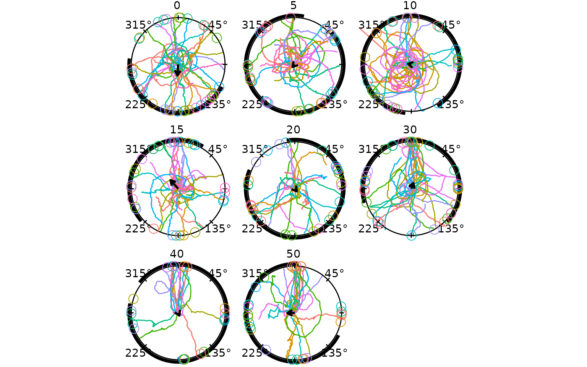

Because millipede tracks are nearly radial, the heading estimates agree
closely across methods. For more sinuous species (moths, pigeons) the
choice of rule has a larger influence on the result.

### net

The **net** rule returns the direction of the vector from the first
recorded position to the last, ignoring all intermediate points. It is
the fastest possible estimate and is the natural match for GPS
vanishing-bearing studies where only the release and final observed
positions are available.

``` r

hd_net <- derive_headings(cpunctatus, rule = "net")
names(hd_net)[names(hd_net) == "id"] <- "trial_id"
# join the target half-width (arc) from the dataset, as for the crossing rule
hd_net     <- merge(hd_net, arc_map, by = "trial_id")
hd_net$arc <- factor(hd_net$arc)

sm_net <- compute_circ_mean(hd_net, group_col = "arc")[, c("arc", "resultant_R")]
names(sm_net)[2] <- "net"
Reduce(function(a, b) merge(a, b, by = "arc"),
       list(sm_cross, sm_distal, sm_net))
#>   arc   crossing     distal        net
#> 1   0 0.21852376 0.23531457 0.22962978
#> 2  10 0.27298867 0.07055967 0.05152922
#> 3  15 0.25745294 0.24477975 0.23894631
#> 4  20 0.10968390 0.07326231 0.02827464
#> 5  30 0.16285026 0.12936762 0.11498421
#> 6  40 0.12904693 0.06536414 0.06850022
#> 7   5 0.03518184 0.07181952 0.05236747
#> 8  50 0.09148952 0.15790182 0.15353222
```

For these tracks the three methods give very similar resultant lengths.
Larger differences would be expected for species with complex search
behaviour before committing to a direction.
