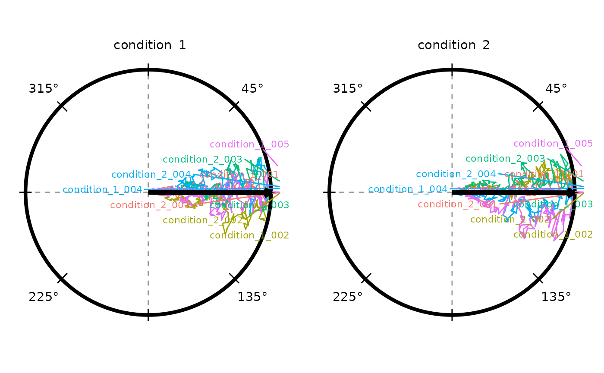

# radiatR

``` r

if (requireNamespace("pkgload", quietly = TRUE)) {
  # Always load from source so the vignette reflects the current development state.
  pkgload::load_all("..", export_all = FALSE, helpers = FALSE, quiet = TRUE)
} else if (requireNamespace("radiatR", quietly = TRUE)) {
  library(radiatR)
} else {
  stop("Package 'radiatR' not installed and 'pkgload' not available.")
}
library(ggplot2)
```

## Overview

`radiatR` streamlines the journey from raw tracking files to
publication-ready plots for experiments conducted in circular arenas.
The package includes:

- utilities for importing paired landmark/track text files produced by
  popular tracking suites;
- helpers for extracting trial limits and computing circular summary
  statistics;
- polished `ggplot2` layers for drawing concentric guides and annotated
  paths.

## Import Pipeline

The package ships five arc = 0° example tracks that demonstrate the full
import workflow. Landmark files (`_point01.txt`) record two pixel-space
reference points per trial (arena centre and reference point on the
arena wall); track files (`_point02.txt`) contain the full xy
trajectory.

``` r

track_dir     <- system.file("extdata", "tracks", package = "radiatR")
manifest_path <- system.file("extdata", "P_lividus_trials.csv", package = "radiatR")

file_tbl  <- import_tracks(track_dir)
manifest  <- import_info(manifest_path)
file_tbl  <- load_tracks(file_tbl, manifest, track_dir)

ts_demo <- get_all_object_pos(file_tbl = file_tbl, track_dir = track_dir)
ts_demo
#> TrajSet: 5 trajectories, 2049 observations
#> Columns: id='trial_id', time='frame', angle='rel_theta' (radians), x='trans_x', y='trans_y'
#> Transform steps: unit_circle_mapping 
#> # A tibble: 6 × 15
#>   trial_id       frame     x     y trans_x trans_y trans_rho abs_theta rel_theta
#>   <chr>          <int> <dbl> <dbl>   <dbl>   <dbl>     <dbl>     <dbl>     <dbl>
#> 1 G1D_0_obstacl…     1 1045.  559.   0.181 -0.0395     0.186      6.07      3.93
#> 2 G1D_0_obstacl…     2 1045.  559.   0.181 -0.0395     0.186      6.07      3.93
#> 3 G1D_0_obstacl…     3 1050.  560.   0.191 -0.0407     0.196      6.07      3.93
#> 4 G1D_0_obstacl…     4 1050.  560.   0.191 -0.0407     0.196      6.07      3.93
#> 5 G1D_0_obstacl…     5 1052.  560.   0.197 -0.0407     0.202      6.08      3.94
#> 6 G1D_0_obstacl…     6 1053.  560.   0.199 -0.0407     0.203      6.08      3.94
#> # ℹ 6 more variables: rel_x <dbl>, rel_y <dbl>, video <chr>, order <chr>,
#> #   vid_ord <chr>, radius <dbl>
```

[`get_all_object_pos()`](https://johnkirwan.github.io/radiatR/reference/get_all_object_pos.md)
reads each landmark/track pair, normalises coordinates to a unit circle
(arena radius = 1), and returns a `TrajSet`. Trial metadata (arena
radius, reference position, frame limits) is in
`ts_demo@meta$trial_limits`.

## Full *P. lividus* Dataset

The package also provides `plividus`, a pre-computed `TrajSet`
containing all 401 trajectories from the experiment across six stimulus
arc-angle conditions (0°, 15°, 30°, 45°, 60°, 150°). Loading it is
instant.

``` r

data(plividus)
plividus
#> TrajSet: 402 trajectories, 134375 observations
#> Columns: id='trial_id', time='frame', angle='rel_theta' (radians), x='trans_x', y='trans_y', rel_x='rel_x', rel_y='rel_y'
#> Transform steps: unit_circle_mapping 
#> # A tibble: 6 × 16
#>   trial_id       frame     x     y trans_x trans_y trans_rho abs_theta rel_theta
#>   <chr>          <int> <dbl> <dbl>   <dbl>   <dbl>     <dbl>     <dbl>     <dbl>
#> 1 G1D_0_obstacl…     1 1045.  559.   0.181 -0.0395     0.186    -0.214      3.93
#> 2 G1D_0_obstacl…     2 1045.  559.   0.181 -0.0395     0.186    -0.214      3.93
#> 3 G1D_0_obstacl…     3 1050.  560.   0.191 -0.0407     0.196    -0.210      3.93
#> 4 G1D_0_obstacl…     4 1050.  560.   0.191 -0.0407     0.196    -0.210      3.93
#> 5 G1D_0_obstacl…     5 1052.  560.   0.197 -0.0407     0.202    -0.203      3.94
#> 6 G1D_0_obstacl…     6 1053.  560.   0.199 -0.0407     0.203    -0.202      3.94
#> # ℹ 7 more variables: rel_x <dbl>, rel_y <dbl>, video <chr>, order <chr>,
#> #   vid_ord <chr>, radius <dbl>, arc <fct>
```

## Plotting Trajectories

[`radiate()`](https://johnkirwan.github.io/radiatR/reference/radiate.md)
draws trajectories on a unit circle with concentric reference rings.
Colouring by the `arc` factor shows how paths cluster by condition.

``` r

radiate(plividus,
        group_col  = "trial_id",
        colour_col = "arc",
        show_labels = FALSE,
        show_arrow  = FALSE)
```


## Heading Overlays

The **crossing method** — projecting the vector between two
concentric-ring crossings to the unit circle — assigns one directional
heading per trial.
[`derive_headings()`](https://johnkirwan.github.io/radiatR/reference/derive_headings.md)
with `return_coords = TRUE` returns both the heading angle and the
inner-ring crossing position.

``` r

hd <- derive_headings(plividus, rule = "crossing",
                      circ0 = 0.2, circ1 = 0.4,
                      coords = "relative",
                      angle_convention = "clock",
                      return_coords = TRUE)
# add arc grouping for faceting
hd$arc <- factor(
  as.integer(sub("G1D_(\\d+)_.*", "\\1", hd$id)),
  levels = c(0, 15, 30, 45, 60, 150),
  labels = c("0°", "15°", "30°", "45°", "60°", "150°")
)
names(hd)[names(hd) == "id"] <- "trial_id"
attr(hd, "colour_col") <- "arc"
head(hd[, c("trial_id", "arc", "heading", "x_inner", "y_inner")])
#>                                     trial_id arc   heading     x_inner
#> 1 G1D_0_obstacle/WIN_20210201_11_24_19_Pro_1  0° 2.4162200 -0.14005857
#> 2 G1D_0_obstacle/WIN_20210201_11_32_56_Pro_1  0° 2.6851092 -0.09694777
#> 3 G1D_0_obstacle/WIN_20210204_16_55_13_Pro_1  0° 2.0733246  0.07213251
#> 4 G1D_0_obstacle/WIN_20210204_17_12_38_Pro_1  0° 2.0834057 -0.18174038
#> 5 G1D_0_obstacle/WIN_20210204_17_30_19_Pro_1  0° 0.3838676  0.19833263
#> 6 G1D_0_obstacle/WIN_20210204_17_44_09_Pro_1  0° 2.6079536 -0.19480474
#>       y_inner
#> 1 -0.14277011
#> 2 -0.17493178
#> 3 -0.18652985
#> 4 -0.08347969
#> 5 -0.02577011
#> 6 -0.04528552
```

Overlaying the heading endpoints (one hollow circle per trial) and the
grand mean direction on the combined trajectory plot gives a compact
summary of the full dataset:

``` r

p_all <- radiate(plividus,
                 group_col   = "trial_id",
                 colour_col  = "arc",
                 show_labels = FALSE,
                 show_arrow  = FALSE) +
  add_heading_points(hd, colour_col = "arc", size = 1, alpha = 0.6)

p_all + add_heading_arrow(hd)
#> Warning: Removed 1 row containing missing values or values outside the scale range
#> (`geom_point()`).
```


The grand mean arrow points at 320.9° relative to the reference
direction (clock convention; 0° = toward reference) with *R* = 0.08,
reflecting the overall reference-relative tendency across all
conditions.

## Circular Interval Arc

Three functions handle directional uncertainty arcs in parallel with the
density overlay functions:

| Function | Role |
|----|----|
| [`compute_circ_interval()`](https://johnkirwan.github.io/radiatR/reference/compute_circ_interval.md) | Computes arc bounds from raw headings; returns a data frame with `lower`, `upper`, `mean_dir`, and `wraps` |
| [`add_circ_interval()`](https://johnkirwan.github.io/radiatR/reference/add_circ_interval.md) | Renders any bounds data frame as an arc at a configurable radius — agnostic to how the bounds were produced |
| [`add_heading_interval()`](https://johnkirwan.github.io/radiatR/reference/add_heading_interval.md) | Convenience wrapper: calls the two above in sequence |

Two statistics are supported: `stat = "bootstrap_ci"` bootstraps the von
Mises MLE confidence interval for the mean direction; `stat = "sd"`
draws a ±1 circular SD arc. The split design lets you substitute
Bayesian credible bounds into the data frame before rendering:

``` r

iv <- compute_circ_interval(hd, colour_col = "arc", stat = "bootstrap_ci")
# replace with Bayesian posteriors: iv$lower <- ...; iv$upper <- ...
add_circ_interval(iv, colour_col = "arc")
```

## Building Up a Panel

Layers compose with the standard `ggplot2` `+` operator, so a plot can
be assembled feature by feature. The four chunks below start from
trajectories only and add heading endpoints, the grand mean arrow, and
finally a bootstrap CI arc.

**Trajectories:**

``` r

p <- radiate(plividus,
             group_col   = "trial_id",
             colour_col  = "arc",
             show_labels = FALSE,
             show_arrow  = FALSE)
p
```


**+ Heading endpoints** at each trial’s crossing location:

``` r

p <- p + add_heading_points(hd, colour_col = "arc", size = 1.5, alpha = 0.7)
p
#> Warning: Removed 1 row containing missing values or values outside the scale range
#> (`geom_point()`).
```


**+ Grand mean direction arrow:**

``` r

p <- p + add_heading_arrow(hd)
p
#> Warning: Removed 1 row containing missing values or values outside the scale range
#> (`geom_point()`).
```


The arc at radius 1.05 spans the 95 % bootstrap confidence interval for
the grand mean direction pooled across all arc conditions.

## Colour Options

Three strategies control how trajectories are coloured.

**Option 1 — single colour.** Pass a colour string directly to the
heading-overlay helpers; omit `colour_col` from
[`radiate()`](https://johnkirwan.github.io/radiatR/reference/radiate.md)
to draw all tracks in the default grey.

**Option 2 — cycling palette.** `colour_cycle` assigns each trajectory a
colour index that cycles back to 1 after every *n* trajectories. When
`panel_by` is set the cycle restarts independently within each panel so
that trajectory 1 in every panel always gets colour 1. Pass an integer
for automatic palette assignment, or a character vector to specify
colours explicitly.

**Option 3 — variable mapping.** `colour_col` maps any data column to
colour (e.g. the `arc` factor used in the combined-trajectory plot
above).

## Per-Condition Panels

Faceting by arc angle shows each condition separately. Within each
panel,
[`assign_cycle_colours()`](https://johnkirwan.github.io/radiatR/reference/assign_cycle_colours.md)
distinguishes individual trajectories by cycling through 10 colours,
resetting at each panel boundary. Calling it explicitly on both the
track data and the headings data frame (joining by trial id) means
heading markers inherit the exact per-trajectory colour — not a single
per-condition colour — when `colour_col` is used for both.

``` r

# Pre-compute cycling colours: 10 colours, restarting within each arc panel.
# Join to headings so heading layers can use the same column.
plividus_cc        <- plividus
plividus_cc@data   <- assign_cycle_colours(plividus@data,
                                            id_col    = "trial_id",
                                            n         = 10,
                                            panel_col = "arc")
colour_map <- unique(plividus_cc@data[, c("trial_id", "cycle_colour")])
hd_cc      <- merge(hd, colour_map,
                    by      = "trial_id", all.x = TRUE)
# merge() strips attributes — restore convention metadata from hd
attr(hd_cc, "angle_convention")   <- attr(hd, "angle_convention")
attr(hd_cc, "coords")             <- attr(hd, "coords")
attr(hd_cc, "display_convention") <- attr(hd, "display_convention")
attr(hd_cc, "colour_col")         <- "cycle_colour"
```

``` r

p <- radiate(plividus_cc,
        group_col    = "trial_id",
        colour_col   = "cycle_colour",
        panel_by     = "arc",
        ncol         = 3,
        show_labels  = FALSE,
        show_arrow   = FALSE)
p
```


**+ Bootstrap CI arc** added first so it sits behind heading markers:

``` r

p <- p + add_heading_interval(hd_cc, colour_col = "arc", colour = "black",
                               stat = "bootstrap_ci", boot_reps = 999L)
p
```


**+ Heading vectors** (dotted lines from inner crossing to perimeter):

``` r

p <- p + add_heading_vectors(hd_cc)
p
#> Warning: Removed 1 row containing missing values or values outside the scale range
#> (`geom_segment()`).
```


**+ Heading points** on top of the CI arc:

``` r

p <- p + add_heading_points(hd_cc, size = 4)
p
#> Warning: Removed 1 row containing missing values or values outside the scale range
#> (`geom_segment()`).
#> Warning: Removed 1 row containing missing values or values outside the scale range
#> (`geom_point()`).
```


``` r

p <- p + add_heading_arrow(hd_cc, colour_col = "arc", colour = "black")
p
#> Warning: Removed 1 row containing missing values or values outside the scale range
#> (`geom_segment()`).
#> Warning: Removed 1 row containing missing values or values outside the scale range
#> (`geom_point()`).
```


Each panel shows trajectories and heading markers coloured by
per-trajectory cycling palette, a bootstrap CI arc at radius 1.05 in the
condition colour (rendered behind the heading points), a solid mean
direction arrow, and degree labels. All in clock convention (0° = toward
reference, clockwise). Use `strip_position = "inside"` to place the
label inside the plot area, or `strip_labels = FALSE` to suppress it.

## Circular Density Overlays

Three functions handle directional density overlays; they are designed
to compose cleanly with any density source:

| Function | Role |
|----|----|
| [`compute_circular_density()`](https://johnkirwan.github.io/radiatR/reference/compute_circular_density.md) | Estimates density from raw headings; returns a plain data frame of `(theta, density)` pairs |
| [`add_circular_density()`](https://johnkirwan.github.io/radiatR/reference/add_circular_density.md) | Renders any `(theta, density)` data frame as a radial overlay — agnostic to how the density was produced |
| [`add_heading_density()`](https://johnkirwan.github.io/radiatR/reference/add_heading_density.md) | Convenience wrapper: calls the two above in sequence |

Three built-in methods are available in
[`compute_circular_density()`](https://johnkirwan.github.io/radiatR/reference/compute_circular_density.md):
`"vonmises"` (MLE via
[`circular::mle.vonmises()`](https://rdrr.io/pkg/circular/man/mle.vonmises.html)),
`"kernel"` (circular KDE), and `"histogram"` (bin counts). Because the
computation and rendering steps are separate, the `density` column can
be replaced with values from any other model — including a Bayesian
posterior predictive density from `brms` — before calling
[`add_circular_density()`](https://johnkirwan.github.io/radiatR/reference/add_circular_density.md):

``` r

dens_df <- compute_circular_density(hd, colour_col = "arc", method = "vonmises")
# replace with Bayesian posterior: dens_df$density <- my_brms_fitted_density(dens_df$theta)
add_circular_density(dens_df, colour_col = "arc", fill = "grey80", alpha = 0.35)
```

The convenience wrapper
[`add_heading_density()`](https://johnkirwan.github.io/radiatR/reference/add_heading_density.md)
skips the intermediate step when no substitution is needed. The combined
panel plot below uses it to shade a per-condition von Mises density
alongside the heading vectors:

``` r

radiate(plividus_cc,
        group_col    = "trial_id",
        colour_col   = "cycle_colour",
        panel_by     = "arc",
        ncol         = 3,
        show_labels  = FALSE,
        show_arrow   = FALSE) +
  add_heading_density(hd_cc, colour_col = "arc",
                      method = "vonmises", scale = 0.4,
                      fill = "grey80", alpha = 0.35) +
  add_heading_vectors(hd_cc) +
  add_heading_arrow(hd_cc, colour_col = "arc", colour = "black")
#> Warning: Removed 1 row containing missing values or values outside the scale range
#> (`geom_segment()`).
```


The shaded region is the von Mises density fitted to the crossing
headings within each arc condition. A narrower, taller peak indicates
more concentrated directional responses. Switch to `method = "kernel"`
for a non-parametric estimate, or `method = "histogram"` for a raw count
display.

## Bootstrap Confidence Band

[`compute_circular_density()`](https://johnkirwan.github.io/radiatR/reference/compute_circular_density.md)
with `boot_reps > 0` runs a non-parametric bootstrap: heading samples
are drawn with replacement, a von Mises MLE is fitted to each replicate,
and the density is re-evaluated on the same angular grid. The
`boot_alpha / 2` and `1 - boot_alpha / 2` quantiles across replicates
become `density_lower` and `density_upper` columns, which
[`add_circular_density()`](https://johnkirwan.github.io/radiatR/reference/add_circular_density.md)
renders as a shaded band around the fitted curve.

``` r

dens_boot <- compute_circular_density(hd, colour_col = "arc",
                                      method = "vonmises",
                                      boot_reps = 499L, boot_alpha = 0.05,
                                      n_theta = 300L)

radiate(plividus,
        group_col    = "trial_id",
        colour_cycle = 10,
        panel_by     = "arc",
        ncol         = 3,
        show_labels  = FALSE,
        show_arrow   = FALSE) +
  add_circular_density(dens_boot, colour_col = "arc",
                       scale = 0.4, fill = "grey80", alpha = 0.35,
                       ci_fill = "grey60", ci_alpha = 0.35) +
  add_heading_arrow(hd, colour_col = "arc", colour = "black")
```


The darker band is the 95% bootstrap confidence interval for the fitted
von Mises density. A wider band reflects greater parametric uncertainty,
typically seen in the smaller or more diffuse conditions. The
`density_lower` and `density_upper` columns in `dens_boot` can be
replaced with interval values from a Bayesian model (e.g. the 2.5th and
97.5th percentiles of a `brms` posterior predictive distribution) before
passing to
[`add_circular_density()`](https://johnkirwan.github.io/radiatR/reference/add_circular_density.md).

## Circular Summary Statistics

[`compute_circ_mean()`](https://johnkirwan.github.io/radiatR/reference/compute_circ_mean.md)
returns the per-condition statistics behind the arrows above:

``` r

compute_circ_mean(hd, colour_col = "arc")[, c("arc", "mean_dir", "resultant_R")]
#>    arc  mean_dir resultant_R
#> 1   0° 2.9665112  0.08994719
#> 2  15° 3.5404166  0.13925405
#> 3  30° 1.8195779  0.15168934
#> 4  45° 0.5097922  0.17151292
#> 5  60° 0.4702453  0.23689999
#> 6 150° 0.2814510  0.13477135
```

For within-trial path consistency (tortuosity),
[`circ_summary()`](https://johnkirwan.github.io/radiatR/reference/circ_summary.md)
operates on the step-by-step angle distribution:

``` r

circ_summary(ts_demo)
#>                                           id   n t_start t_end mean_dir
#> 1 G1D_0_obstacle/WIN_20210201_11_24_19_Pro_1 231       1   231 3.864172
#> 2 G1D_0_obstacle/WIN_20210201_11_32_56_Pro_1 507       2   508 3.868930
#> 3 G1D_0_obstacle/WIN_20210204_16_55_13_Pro_1 664       2   665 5.207857
#> 4 G1D_0_obstacle/WIN_20210204_17_12_38_Pro_1 345       1   345 4.034956
#> 5 G1D_0_obstacle/WIN_20210204_17_30_19_Pro_1 302       2   303 5.901587
#>   resultant_R kappa
#> 1   0.9986428    NA
#> 2   0.9369969    NA
#> 3   0.7960073    NA
#> 4   0.9408862    NA
#> 5   0.9580959    NA
```

High resultant lengths (close to 1) indicate very consistent step
directions within a trial.

## Alternative Heading Rules

[`derive_headings()`](https://johnkirwan.github.io/radiatR/reference/derive_headings.md)
supports fourteen built-in rules. `"crossing"` is well suited to
echinoderm-style tracks — moderate tortuosity, consistent outward
movement — but other rules may be more appropriate depending on the
taxon and experimental design. Use
[`list_heading_rules()`](https://johnkirwan.github.io/radiatR/reference/list_heading_rules.md)
to see all available names; custom rules can be added with
[`register_heading_rule()`](https://johnkirwan.github.io/radiatR/reference/register_heading_rule.md).

Two parameter-free alternatives are especially useful:

| Rule | What it returns | Typical use |
|----|----|----|
| `"distal"` | Angular position of the frame with the largest radius | Straight outward paths (dung beetles, ballistic homing) |
| `"net"` | Direction of the start-to-end displacement vector | Sinuous or multi-phase paths where only net displacement matters |

### distal

The **distal** rule takes `atan2(y, x)` at the frame where the animal is
farthest from the arena centre. It requires no ring parameters and never
returns `NA` because every trial has a most-distal frame.

``` r

hd_distal <- derive_headings(plividus, rule = "distal",
                              coords = "relative",
                              angle_convention = "clock",
                              return_coords = TRUE)
hd_distal$arc <- factor(
  as.integer(sub("G1D_(\\d+)_.*", "\\1", hd_distal$id)),
  levels = c(0, 15, 30, 45, 60, 150),
  labels = c("0°", "15°", "30°", "45°", "60°", "150°")
)
names(hd_distal)[names(hd_distal) == "id"] <- "trial_id"
```

Per-condition resultant lengths from `"distal"` are very close to those
from `"crossing"`, consistent with *P. lividus* tracks being fairly
direct:

``` r

sm_cross  <- compute_circ_mean(hd,       colour_col = "arc")[, c("arc", "resultant_R")]
sm_distal <- compute_circ_mean(hd_distal, colour_col = "arc")[, c("arc", "resultant_R")]
names(sm_cross)[2]  <- "crossing"
names(sm_distal)[2] <- "distal"
merge(sm_cross, sm_distal, by = "arc")
#>    arc   crossing     distal
#> 1   0° 0.08994719 0.09866019
#> 2  15° 0.13925405 0.12900871
#> 3 150° 0.13477135 0.14318298
#> 4  30° 0.15168934 0.15934680
#> 5  45° 0.17151292 0.18744397
#> 6  60° 0.23689999 0.19465067
```

Visualising the distal headings on the per-condition panel confirms that
the spatial pattern is consistent with the crossing method:

``` r

plividus_cc_d        <- plividus
plividus_cc_d@data   <- assign_cycle_colours(plividus@data,
                                              id_col    = "trial_id",
                                              n         = 10,
                                              panel_col = "arc")
colour_map_d <- unique(plividus_cc_d@data[, c("trial_id", "cycle_colour")])
hd_distal_cc <- merge(hd_distal, colour_map_d, by = "trial_id", all.x = TRUE)
attr(hd_distal_cc, "angle_convention")   <- attr(hd_distal, "angle_convention")
attr(hd_distal_cc, "coords")             <- attr(hd_distal, "coords")
attr(hd_distal_cc, "display_convention") <- attr(hd_distal, "display_convention")
attr(hd_distal_cc, "colour_col")         <- "cycle_colour"

radiate(plividus_cc_d,
        group_col   = "trial_id",
        colour_col  = "cycle_colour",
        panel_by    = "arc",
        ncol        = 3,
        show_labels = FALSE,
        show_arrow  = FALSE) +
  add_heading_interval(hd_distal_cc, colour_col = "arc", colour = "black",
                       stat = "bootstrap_ci", boot_reps = 999L) +
  add_heading_points(hd_distal_cc, size = 4) +
  add_heading_arrow(hd_distal_cc, colour_col = "arc", colour = "black")
```


Because *P. lividus* tracks are nearly radial, the heading estimates
agree closely across methods. For more sinuous species (moths, pigeons)
the choice of rule has a larger influence on the result.

### net

The **net** rule returns the direction of the vector from the first
recorded position to the last, ignoring all intermediate points. It is
the fastest possible estimate and is the natural match for GPS
vanishing-bearing studies where only the release and final observed
positions are available.

``` r

hd_net <- derive_headings(plividus, rule = "net",
                           coords = "relative",
                           angle_convention = "clock")
hd_net$arc <- factor(
  as.integer(sub("G1D_(\\d+)_.*", "\\1", hd_net$id)),
  levels = c(0, 15, 30, 45, 60, 150),
  labels = c("0°", "15°", "30°", "45°", "60°", "150°")
)
names(hd_net)[names(hd_net) == "id"] <- "trial_id"

sm_net <- compute_circ_mean(hd_net, colour_col = "arc")[, c("arc", "resultant_R")]
names(sm_net)[2] <- "net"
Reduce(function(a, b) merge(a, b, by = "arc"),
       list(sm_cross, sm_distal, sm_net))
#>    arc   crossing     distal       net
#> 1   0° 0.08994719 0.09866019 0.1003765
#> 2  15° 0.13925405 0.12900871 0.1350682
#> 3 150° 0.13477135 0.14318298 0.1382390
#> 4  30° 0.15168934 0.15934680 0.1635828
#> 5  45° 0.17151292 0.18744397 0.1858180
#> 6  60° 0.23689999 0.19465067 0.1978115
```

For these tracks the three methods give very similar resultant lengths.
Larger differences would be expected for species with complex search
behaviour before committing to a direction.

## Simulating Demo Data

[`simulate_tracks()`](https://johnkirwan.github.io/radiatR/reference/simulate_tracks.md)
generates synthetic trajectories without any files, useful for testing
and demonstrations. The `kappa` parameter controls directedness:

``` r

sim_df <- simulate_tracks(
  conditions = data.frame(n_trials = c(5L, 5L), kappa = c(2, 8)),
  n_points = 150,
  seed = 42
)
ts_sim <- TrajSet(
  sim_df,
  id = "trial_id", time = "frame",
  angle = "rel_theta", x = "rel_x", y = "rel_y",
  angle_unit = "radians", normalize_xy = FALSE
)
radiate(ts_sim,
        group_col    = "trial_id",
        colour_cycle = 5,
        panel_by     = "condition",
        ncol         = 2,
        show_arrow   = TRUE)
```



The left panel (low `kappa`) shows tortuous paths; the right (high
`kappa`) shows straighter, more directed tracks. The mean resultant
arrow is computed independently per panel.
