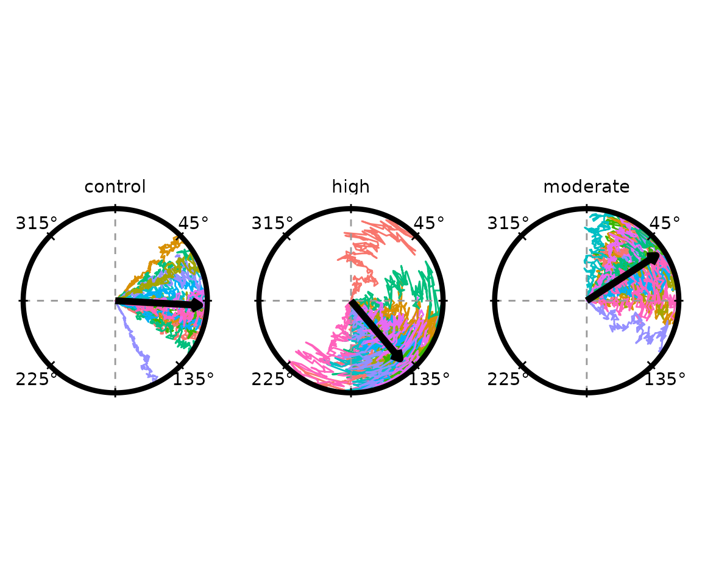
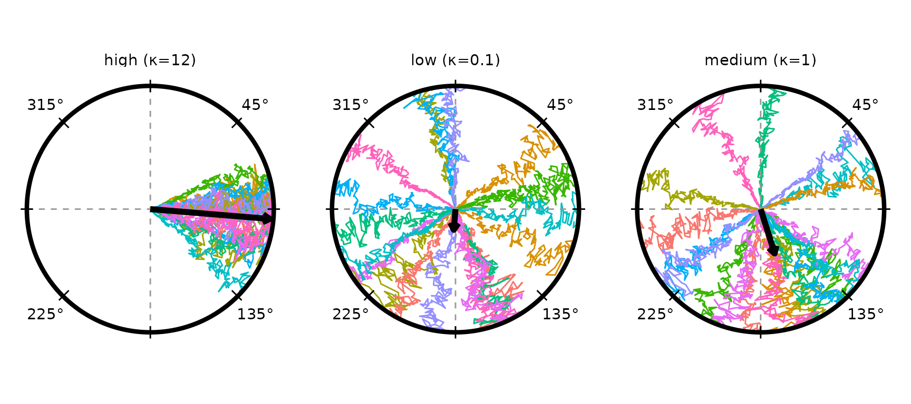
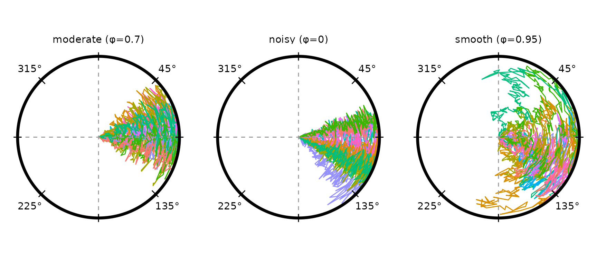
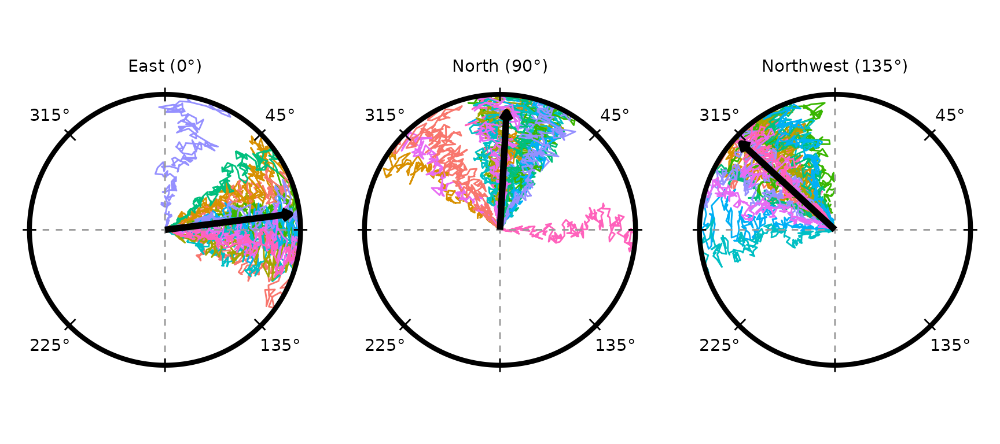
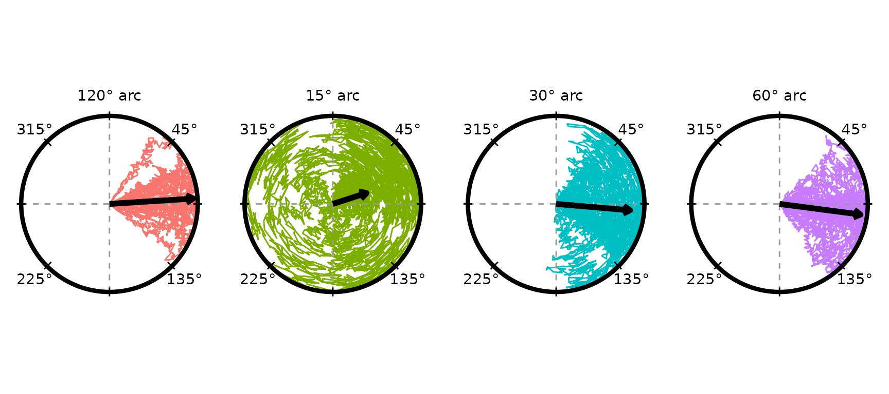
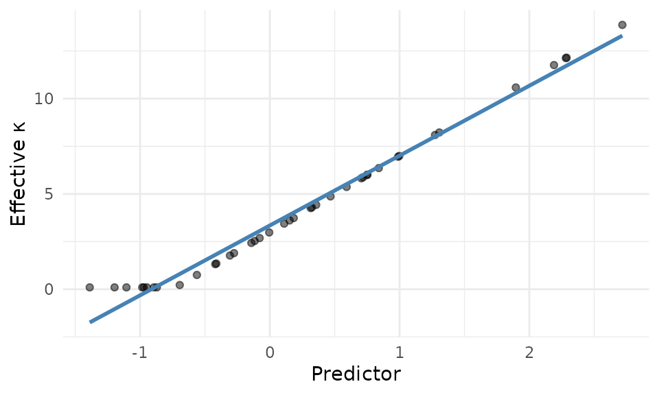
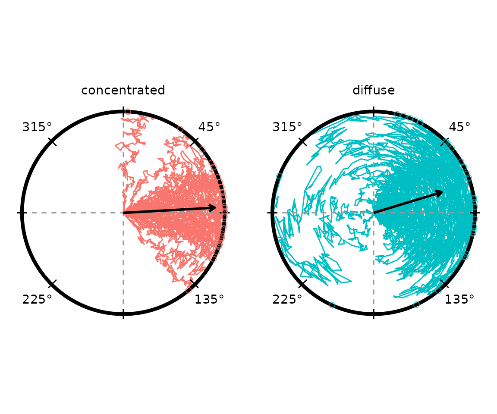

# Simulating Trajectories

``` r

if (requireNamespace("pkgload", quietly = TRUE)) {
  pkgload::load_all("..", export_all = FALSE, helpers = FALSE, quiet = TRUE)
} else if (requireNamespace("radiatR", quietly = TRUE)) {
  library(radiatR)
} else {
  stop("Package 'radiatR' not installed and 'pkgload' not available.")
}
library(ggplot2)
```

## Overview

[`simulate_tracks()`](https://johnkirwan.github.io/radiatR/reference/simulate_tracks.md)
generates synthetic circular-arena trajectories without any tracking
files. Its main uses are:

- Verifying that a new analysis pipeline works before real data arrives.
- Reproducing plots and examples in documentation.
- Teaching: demonstrating how concentration, tortuosity, and directional
  bias each affect the appearance of paths.
- Informal power analysis: generate data under a plausible effect size
  and check whether the expected statistical pattern is visible.

------------------------------------------------------------------------

## Quick Start

Called with no arguments,
[`simulate_tracks()`](https://johnkirwan.github.io/radiatR/reference/simulate_tracks.md)
returns a tibble of three conditions (60 trials total, 200 frames each):

``` r

sim <- simulate_tracks(seed = 1)
dim(sim)
#> [1] 12000    16
names(sim)
#>  [1] "condition"     "trial_id"      "trial_num"     "frame"        
#>  [5] "predictor"     "concentration" "tortuosity"    "ref_heading"  
#>  [9] "final_heading" "rho"           "abs_theta"     "rel_theta"    
#> [13] "abs_x"         "abs_y"         "rel_x"         "rel_y"
```

Each row is one frame. The key columns are:

| Column                   | Description                                     |
|--------------------------|-------------------------------------------------|
| `condition`              | Condition label                                 |
| `trial_id`               | Unique trial identifier (`<condition>_<index>`) |
| `frame`                  | Frame number within the trial                   |
| `predictor`              | Per-trial continuous covariate value            |
| `concentration`          | Effective von Mises κ for the trial             |
| `tortuosity`             | Effective angular noise σ for the trial         |
| `final_heading`          | Drawn heading (unit-circle radians)             |
| `abs_x`, `abs_y`         | Absolute position on the unit disc              |
| `rel_x`, `rel_y`         | Position re-centred on the heading direction    |
| `abs_theta`, `rel_theta` | Corresponding angular coordinates               |

------------------------------------------------------------------------

## Output Formats

The `output` argument controls what is returned.

``` r

# Default: long-form tibble
sim_tbl  <- simulate_tracks(seed = 1, output = "tibble")

# TrajSet directly (ready for radiate(), derive_headings(), etc.)
sim_ts   <- simulate_tracks(seed = 1, output = "trajset")

# Both representations in a named list
sim_both <- simulate_tracks(seed = 1, output = "both")
names(sim_both)  # "tibble" "trajset"
```

The `output = "trajset"` path wraps the tibble in a `TrajSet` (absolute
coordinates, no normalisation). Use it whenever you want to plug
straight into the plotting or analysis functions.

------------------------------------------------------------------------

## Plotting the Default Simulation

``` r

ts_default <- simulate_tracks(seed = 1, output = "trajset")
radiate(ts_default,
        group_col    = "trial_id",
        colour_cycle = 10,
        panel_by     = "condition",
        ncol         = 3,
        show_labels  = FALSE,
        show_arrow   = TRUE)
```



The three default conditions differ in directional bias, concentration,
and tortuosity (see below).

------------------------------------------------------------------------

## The Conditions Table

All simulation behaviour is controlled by a data frame passed to
`conditions`. When `conditions = NULL` the function fills in a
three-condition template. Supply your own data frame to override any
subset of columns; missing columns receive sensible defaults.

| Column | Default | Description |
|----|----|----|
| `condition` | `"condition_N"` | Label for the condition |
| `n_trials` | `10` | Number of trajectories |
| `ref_mean` | `0` | Baseline reference direction (unit-circle radians) |
| `concentration_base` | `5` | Baseline von Mises κ |
| `concentration_slope` | `0` | Slope of κ on the per-trial predictor |
| `tortuosity_base` | `0.06` | Baseline angular noise σ |
| `tortuosity_slope` | `0` | Slope of σ on the predictor |
| `tortuosity_sd` | `0.01` | Trial-to-trial variability in σ |
| `predictor_mean` | `0` | Mean of the per-trial predictor distribution |
| `predictor_sd` | `0.2` | SD of the predictor distribution |
| `predictor_values` | (none) | Optional list-column of explicit predictor values |

------------------------------------------------------------------------

## Concentration (κ)

`concentration_base` is the von Mises κ passed to `rvonmises()`. Higher
values produce tightly clustered headings; values near zero produce
near-uniform heading distributions.

``` r

conds_kappa <- data.frame(
  condition          = c("low (κ=0.1)", "medium (κ=1)", "high (κ=12)"),
  n_trials           = 20L,
  concentration_base = c(0.1, 1, 12),
  tortuosity_base    = 0.05
)
ts_kappa <- simulate_tracks(conditions = conds_kappa, seed = 42,
                             output = "trajset")
radiate(ts_kappa,
        group_col    = "trial_id",
        colour_cycle = 10,
        panel_by     = "condition",
        ncol         = 3,
        show_labels  = FALSE,
        show_arrow   = TRUE)
```



At κ = 1 the mean arrow is short (low resultant length); at κ = 12
nearly all trials point in the same direction.

------------------------------------------------------------------------

## Tortuosity and Path Smoothness

Two parameters control within-trial path shape:

- `tortuosity_base` — the SD of the per-step angular noise. Larger
  values produce more sinuous paths.
- `phi` — autocorrelation of successive angular deviations (0 = white
  noise, values near 1 produce smooth, sweeping curves). Passed directly
  to
  [`simulate_tracks()`](https://johnkirwan.github.io/radiatR/reference/simulate_tracks.md),
  not via the conditions table.

``` r

conds_tort <- data.frame(
  condition          = c("smooth (φ=0.95)", "moderate (φ=0.7)", "noisy (φ=0)"),
  n_trials           = 15L,
  concentration_base = 6,
  tortuosity_base    = c(0.12, 0.12, 0.12)
)
phi_vals <- c(0.95, 0.7, 0)

# Simulate each phi separately and bind
parts <- lapply(seq_along(phi_vals), function(i) {
  d <- conds_tort[i, , drop = FALSE]
  simulate_tracks(conditions = d, n_points = 200,
                  phi = phi_vals[i], seed = 7 + i)
})
ts_tort <- TrajSet(
  do.call(rbind, parts),
  id = "trial_id", time = "frame",
  x = "abs_x", y = "abs_y", angle = "abs_theta",
  angle_unit = "radians", normalize_xy = FALSE
)
radiate(ts_tort,
        group_col    = "trial_id",
        colour_cycle = 10,
        panel_by     = "condition",
        ncol         = 3,
        show_labels  = FALSE,
        show_arrow   = FALSE)
```



------------------------------------------------------------------------

## Directional Bias (ref_mean)

`ref_mean` shifts the reference direction away from East (0 rad). Use it
to simulate experiments where the reference is not along the positive
x-axis.

``` r

conds_bias <- data.frame(
  condition          = c("East (0°)", "North (90°)", "Northwest (135°)"),
  n_trials           = 20L,
  concentration_base = 5,
  tortuosity_base    = 0.06,
  ref_mean          = c(0, pi / 2, 3 * pi / 4)
)
ts_bias <- simulate_tracks(conditions = conds_bias, seed = 99,
                           output = "trajset")
radiate(ts_bias,
        group_col    = "trial_id",
        colour_cycle = 10,
        panel_by     = "condition",
        ncol         = 3,
        show_labels  = FALSE,
        show_arrow   = TRUE)
```



------------------------------------------------------------------------

## Multi-Condition Gradient

A common design is a monotone gradient in cue strength. The example
below simulates four levels with increasing concentration and decreasing
tortuosity — mimicking an orientation experiment where stronger cues
produce tighter, smoother paths.

``` r

conds_grad <- data.frame(
  condition          = paste0(c(15, 30, 60, 120), "° arc"),
  n_trials           = 25L,
  concentration_base = c(1.5, 3, 6, 10),
  tortuosity_base    = c(0.14, 0.10, 0.06, 0.03),
  tortuosity_sd      = 0.015
)
ts_grad <- simulate_tracks(conditions = conds_grad, n_points = 200,
                            seed = 55, output = "trajset")
radiate(ts_grad,
        group_col    = "trial_id",
        colour_col   = "condition",
        panel_by     = "condition",
        ncol         = 4,
        show_labels  = FALSE,
        show_arrow   = TRUE)
```



------------------------------------------------------------------------

## Continuous Predictor

When `concentration_slope` or `tortuosity_slope` is non-zero, the final
kappa and tortuosity of each trial depend on its sampled predictor
value. This lets you model experiments where individual differences
(e.g. body size, prior exposure) modulate the response.

``` r

conds_pred <- data.frame(
  condition            = "gradient",
  n_trials             = 40L,
  concentration_base   = 3,
  concentration_slope  = 4,    # kappa rises with predictor
  tortuosity_base      = 0.10,
  tortuosity_slope     = -0.04, # smoother at high predictor
  predictor_mean       = 0,
  predictor_sd         = 1
)
sim_pred <- simulate_tracks(conditions = conds_pred, seed = 7, output = "both")

# Each trial gets its own predictor sample
range(sim_pred$tibble$predictor)
#> [1] -1.387996  2.716752
range(sim_pred$tibble$concentration)
#> [1]  0.10000 13.86701
```

Plotting concentration against the predictor confirms the linear
relationship:

``` r

trial_summary <- unique(sim_pred$tibble[, c("trial_id", "predictor",
                                             "concentration")])
ggplot(trial_summary, aes(predictor, concentration)) +
  geom_point(alpha = 0.5) +
  geom_smooth(method = "lm", se = FALSE, colour = "steelblue") +
  labs(x = "Predictor", y = "Effective κ") +
  theme_minimal()
#> `geom_smooth()` using formula = 'y ~ x'
```



------------------------------------------------------------------------

## Connecting to Circular Analysis

Simulated `TrajSet` objects feed directly into
[`derive_headings()`](https://johnkirwan.github.io/radiatR/reference/derive_headings.md)
and
[`circ_summarise()`](https://johnkirwan.github.io/radiatR/reference/circ_summarise.md),
making it straightforward to run the same analysis pipeline on synthetic
data.

``` r

conds_analysis <- data.frame(
  condition          = c("diffuse", "concentrated"),
  n_trials           = 30L,
  concentration_base = c(1.5, 8),
  tortuosity_base    = c(0.12, 0.04)
)
sim_analysis <- simulate_tracks(conditions = conds_analysis, seed = 21,
                                 output = "both")

hd <- derive_headings(sim_analysis$trajset, rule = "crossing",
                       circ0 = 0.2, circ1 = 0.4,
                       coords = "absolute",
                       angle_convention = "unit_circle",
                       return_coords = TRUE)
names(hd)[names(hd) == "id"] <- "trial_id"

# derive_headings returns only id/heading/coords; join condition back
cond_map <- unique(sim_analysis$tibble[, c("trial_id", "condition")])
hd <- merge(hd, cond_map, by = "trial_id")

compute_circ_mean(hd, colour_col = "condition")[,
  c("condition", "mean_dir", "resultant_R")]
#> `angle_convention` not found in headings_df attributes; defaulting to 'unit_circle'.
#> `coords` not found in headings_df attributes; defaulting to 'absolute'.
#>      condition   mean_dir resultant_R
#> 1 concentrated 0.05580664   0.9028539
#> 2      diffuse 0.29537110   0.7004167
```

Visualise the headings alongside the trajectories:

``` r

p <- radiate(sim_analysis$trajset,
             group_col    = "trial_id",
             colour_col   = "condition",
             panel_by     = "condition",
             ncol         = 2,
             show_labels  = FALSE,
             show_arrow   = FALSE) +
  add_heading_points(hd, colour_col = "condition", size = 2, alpha = 0.7) +
  add_heading_arrow(hd, colour_col = "condition", colour = "black")
#> `angle_convention` not found in headings_df attributes; defaulting to 'unit_circle'.
#> `coords` not found in headings_df attributes; defaulting to 'absolute'.
p
```



------------------------------------------------------------------------

## Reproducibility and Saving

Pass `seed` for exact reproducibility. Pass `write_path` to write the
tibble to a CSV alongside (or instead of) returning it — useful when you
want to hand the data to a colleague or another tool.

``` r

simulate_tracks(
  conditions = conds_grad,
  n_points   = 200,
  seed       = 55,
  write_path = "sim_gradient.csv"
)
```
